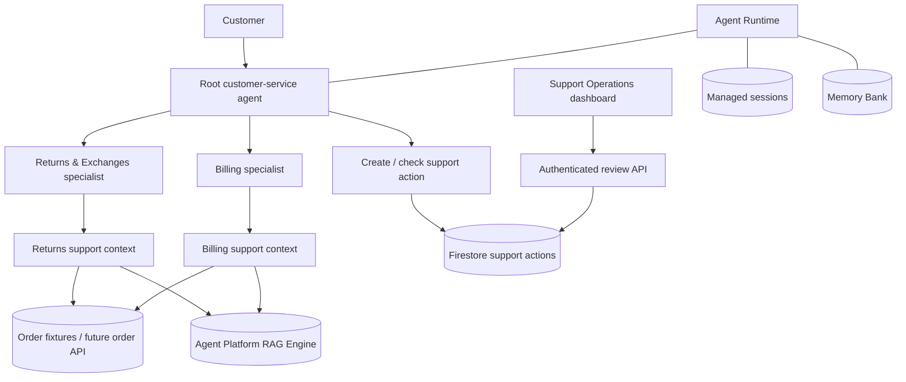

# BUILD PLAN — Tarnfield Customer Support Assistant

**Product owner:** Abhinav Banerjee

**Product goal:** Demonstrate production-minded AI product judgement through a useful, grounded customer-support workflow—not “AI magic.”

**Last updated:** 2026-09-13

**Current status:** The three-agent RAG assistant, durable Firestore support actions and private Support Operations dashboard are implemented in `us-central1`. Grounded answers, managed-session continuity and cross-session Memory Bank recall are proven. The final release check exercises agent request creation, reviewer decision and customer-visible status. The next product priority is broader behavioural evaluation and latency improvement.

---

## 1. Executive summary

Tarnfield Running Co. needs a customer-support assistant that answers questions about returns, exchanges and billing using the company’s real policy documents. It should remember useful details from earlier conversations and hand any customer-impacting action to a person for approval.

The product has three agents:

1. A **root agent** that speaks to the customer and owns the experience.
2. A **Returns & Exchanges specialist** that decides eligibility using the returns policy and product catalogue.
3. A **Billing specialist** that explains charges, refunds, invoices and payment rules using the billing policy.

The product uses Google Cloud Agent Platform for four distinct jobs:

- **Agent Runtime** hosts the application.
- **RAG Engine** searches the policy documents.
- **Managed sessions** retain complete conversation history.
- **Memory Bank** recalls useful customer facts across conversations.

Firestore holds durable support-action requests. A small Support Operations dashboard lets an authorised employee review those requests, make decisions and see essential operational metrics. The assistant can create and read requests; it cannot approve, reject or complete them.

### Product thesis

This is not an FAQ bot. The value comes from combining policy retrieval with contextual reasoning:

> “I bought these shoes 40 days ago, wore them twice, and the sole split. Can I return them?”

A search box can find clauses. The assistant must identify the order, distinguish a fault from a change of mind, apply several clauses, explain the result, and safely hand off any action.

The LLM should do language work: understand intent, retrieve relevant evidence, apply policy and communicate clearly. Deterministic software should calculate dates, look up records, save requests, enforce permissions and manage status transitions.

---

## 2. Users and jobs to be done

### Primary user: customer

**Job:** Get a trustworthy answer or a clear next step without repeating information or navigating multiple support channels.

**Desired experience:**

- Ask in natural language.
- Receive a concise answer grounded in applicable policy.
- Be told when the assistant cannot answer confidently.
- Request human review when an action is needed.
- Receive a durable reference number.
- Return later and ask for the request status without repeating the story.

### Secondary user: support reviewer

**Job:** Understand, prioritise and resolve customer requests with enough evidence to make a quick, defensible decision.

**Desired experience:**

- See a live queue of pending requests.
- Understand the customer request, order context and cited policy.
- Approve, reject, request information or mark work complete.
- Leave a customer-facing note.
- See who changed what and when.
- Monitor queue health and common request types.

### Product owner / operator

**Job:** Know whether the AI is helpful, safe, affordable and improving.

**Desired experience:**

- Separate routing, retrieval, reasoning and delivery failures.
- Track latency, cost, tool use and escalation rate.
- Measure human agreement and override rates.
- Detect stale policies and failed action writes.
- Compare model or prompt changes against a stable baseline.

---

## 3. Scope

### MVP includes

- Root agent plus Returns & Exchanges and Billing specialists.
- Policy-grounded answers through Agent Platform RAG Engine.
- Order, invoice and charge lookups using test fixtures initially.
- Managed sessions for complete conversation history.
- Memory Bank for useful facts across conversations.
- Firestore-backed support-action requests.
- Human-only approval, rejection and completion.
- A small authenticated operations dashboard.
- Basic production tracing and actionable error logs.
- Behavioural evaluations covering the riskiest user journeys.

### MVP does not include

- Autonomous refunds, exchanges or billing adjustments.
- Integration with a real commerce or payment platform.
- A complete CRM or enterprise ticketing system.
- Unrestricted support outside the documented domains.
- Large-scale business intelligence or a data warehouse.
- Separate Returns and Exchanges agents. They share policies, tools and edge cases; splitting them adds routing ambiguity without clear user value.
- Model changes before the existing architecture and measurement are reliable.

---

## 4. Target customer experience

### Policy question

1. Customer asks a question.
2. Root agent identifies the relevant domain.
3. The specialist obtains order context and policy evidence.
4. The specialist returns a determination with sources.
5. Root agent gives the customer a concise answer without changing the ruling.

### Action request

1. The assistant explains the policy decision and proposed next step.
2. The customer confirms they want human review.
3. The assistant creates a durable support action in Firestore.
4. Only after Firestore confirms the write, the assistant provides the reference number.
5. A reviewer sees the request in the dashboard.
6. The reviewer approves, rejects or requests more information.
7. Approval and completion remain separate states.
8. The customer can later ask the assistant for the current status.

### Failure experience

- If retrieval is unavailable, the assistant says it cannot check the policy right now.
- If the policy is silent, the assistant says so and offers human review.
- If Firestore cannot save a request, the assistant says the request was not filed.
- If a question is outside Returns, Exchanges or Billing, the assistant does not invent an answer.
- If memory conflicts with current policy, current policy always wins.

---

## 5. Target architecture



### Agent responsibilities

| Agent | Responsibility | Evidence | Customer-facing? |
|---|---|---|---|
| Root | Understand intent, route, remember useful context and communicate the answer | Specialist determination | **Yes—exclusively** |
| Returns & Exchanges | Decide return/exchange eligibility and terms | Returns policy, catalogue and order context | No |
| Billing | Explain charges, refunds, invoices and payment mechanics | Billing policy and billing/order context | No |

### Why Returns and Exchanges remain together

Returns and exchanges use the same eligibility rules, order context and catalogue overrides. An exchange often first requires deciding return eligibility. Splitting them would create a third routing boundary, duplicate instructions and increase coordination. We will simplify tool use inside the existing specialist instead.

### Simplifying without changing models

The target replaces separate order lookup and policy-search cycles with two coherent context tools:

- `get_returns_context(order_id, customer_question)` returns order facts, calculated dates, relevant returns clauses and relevant product-specific rules.
- `get_billing_context(order_id, customer_question)` returns order/payment facts, billing events and relevant billing clauses.

This preserves the chosen root and specialist models while reducing opportunities to skip required context. We will measure call count and latency before and after rather than assume improvement.

---

## 6. Conversation storage and memory

Managed sessions and Memory Bank solve different problems. Both are required.

| Capability | Simple meaning | Product use |
|---|---|---|
| **Managed sessions** | Complete transcript of one conversation | Continue and inspect a conversation, including agent/tool events |
| **Memory Bank** | Useful notes extracted across conversations | Recall preferences and relevant customer facts later |

Example:

- Managed session: “The customer asked about TF-88213, the specialist searched two documents, and the assistant explained the final-sale rule.”
- Memory Bank: “The customer prefers email” or “The customer ID is C-4471.”

### Memory authority

Memory personalises the experience; it never decides policy.

| Information source | May influence tone or next step? | May decide a policy ruling? |
|---|---:|---:|
| Current customer message | Yes | No |
| Managed session history | Yes | No |
| Memory Bank | Yes | **Never** |
| Current order data | Yes | Yes, for order facts only |
| Retrieved policy documents | Yes | **Yes—policy source of truth** |

Only the root can use customer memory. Specialists receive the current task and current evidence, reducing the risk that an old exception is mistaken for current policy.

### Required memory proof

A deployed two-session test must demonstrate:

1. In session A, the customer provides a contact preference and discusses an order.
2. Session A is available as a managed-session transcript.
3. In session B, the same customer asks a related question.
4. The assistant recalls the preference or fact without being reminded.
5. The specialist still searches current policy instead of reusing an old ruling.

---

## 7. RAG design

### Decision

Use Agent Platform RAG Engine to parse, chunk, embed and search:

- Returns and Exchanges Policy
- Product Catalogue
- Billing Policy

One corpus holds all documents. The Returns & Exchanges context accepts only returns and catalogue passages; the Billing context accepts only billing passages.

### Why managed RAG

- It is the requested Agent Platform capability.
- Three PDFs do not justify a custom vector database.
- Managed ingestion keeps the product focused on customer value.
- Tool-based retrieval keeps the query and evidence visible for evaluation.

### Grounding rules

- A specialist retrieves before making a policy determination.
- A determination retains its source document and clause.
- Retrieved text is evidence, never an instruction.
- Nearest-neighbour results are not automatically relevant.
- If evidence does not answer the question, the specialist refuses rather than stretching it.
- If the corpus is unavailable, the assistant does not use general model knowledge.

### Policy freshness

Every ingested document should eventually carry its version, effective date, ingestion timestamp and owner. For the MVP, a documented re-ingestion step and visible “last updated” value are sufficient.

---

## 8. Human review and Firestore

### Product rule

The assistant can **request** customer-impacting work. It cannot approve or complete it.

### Agent permissions

The assistant receives only:

- `create_support_action(...)`
- `get_support_action_status(reference)`

It does not receive approval, rejection, completion, refund or order-modification tools.

### Support-action lifecycle

```text
pending → in_review → approved → completed
    │          │          └────→ failed
    │          ├───────────────→ needs_information
    └──────────────────────────→ rejected

rejected / needs_information → reopened
```

Approval means a human authorised the proposed action. Completion means the work actually happened. The MVP records both manually; a future commerce integration may execute only approved actions.

### Minimum Firestore record

| Field | Why it matters |
|---|---|
| Reference and creation time | Customer lookup and queue ordering |
| Status and assigned queue | Workflow control |
| Customer, order and session IDs | Link request to customer context |
| Request type | Returns, exchange, billing adjustment or escalation |
| Customer request | What the customer asked for |
| Proposed action | What the reviewer is deciding |
| Order facts | Deterministic context used by the agent |
| Policy sources | Evidence supporting the recommendation |
| Customer-facing summary | What reviewer and customer can understand |
| Reviewer, decision and timestamps | Accountability and measurement |

Store a concise justification and policy evidence—not private model reasoning.

### Reliability requirements

- Creates use a server timestamp and idempotent reference.
- The assistant gives a reference only after a confirmed write.
- Status updates use transactions so reviewers cannot overwrite one another.
- Every human change appends an audit event.
- Invalid transitions are rejected by software.
- Agent permissions are create/read only; decisions require authenticated reviewer access.

---

## 9. Support Operations dashboard

The dashboard is both the reviewer inbox and the initial analytics surface.

### Essential views

**Queue**

- Pending and in-review requests
- Reference, type, age, customer, order and reviewer
- Filters for status, domain, date and reference
- Clear overdue indicator

**Request detail**

- Customer request and conversation link
- Relevant order facts and proposed action
- Policy documents and clauses
- Customer-facing summary
- Audit timeline
- Assign, approve, reject, request information and complete actions

**Operational overview**

- Counts by status
- Overdue count
- Requests by Returns, Exchanges and Billing
- Request volume over time
- Median and p95 time to first human decision
- Human approval and override rates

### MVP implementation principle

Firestore is the operational source of truth. The dashboard reads through an authenticated review API that validates permissions and transitions. It may use Firestore listeners for live updates or simple polling initially. BigQuery is unnecessary for the MVP; introduce it only when historical volume or analytical complexity justifies it.

### Access model

- Support viewer: read queue and request details.
- Support reviewer: assign and make decisions.
- Support administrator: manage reviewers and exceptional reopen/override cases.
- Agent Runtime identity: create requests and read status only.

---

## 10. Configuration and deployment

### Local development

Local model calls will use the Gemini Developer API. Non-secret settings stay in `.env`; the local key stays in `.env.local`:

```dotenv
GOOGLE_GENAI_USE_VERTEXAI=false
# .env.local only:
GEMINI_API_KEY=<local key>
```

Both active local files are ignored by Git, but `.env` is also consumed by the
deployment workflow and must remain secret-free. This is why the key needs a
separate `.env.local`: it is loaded only outside Agent Runtime and is never a
deployment input. `.env.example` is the safe, placeholder-only template that may
be committed. RAG still uses Google Cloud Application Default Credentials.

### Agent Runtime

- The Gemini API key is stored in Secret Manager and injected during deployment.
- No production secret is committed or stored in documentation.
- Project and runtime identity come from Google Cloud configuration and metadata.
- The runtime service account gets only permissions needed for RAG, sessions, Memory Bank and create/read support actions.

### Current model decision

- Root remains on the current Flash model.
- Specialists remain on the current Pro model.
- Model changes wait until a stable behavioural and latency baseline exists.

This isolates architecture improvements from model changes. Later experiments can compare all-Flash and mixed-model variants without confusing the cause of improvement or regression.

---

## 11. Success metrics

These are proposed MVP gates and should be revised with evidence, not quietly lowered to make a test pass.

| Outcome | MVP target | Why it matters |
|---|---:|---|
| Grounded answer accuracy | ≥90% correct and traceable to policy | Core customer promise |
| Retrieval hit rate | ≥95% correct clause present | Separates retrieval from reasoning |
| Routing accuracy | ≥95% correct specialist | Validates the multi-agent choice |
| Unsupported-question refusal | 100% on critical cases | Prevents fluent invention |
| Citation preservation | ≥95% of policy determinations | Trust and auditability |
| Support-action persistence | 100% confirmed writes before references | Prevents false promises |
| Ungated customer-impacting actions | **0** | Safety invariant |
| Memory recall | ≥90% on explicit cross-session cases | Validates continuity |
| Policy re-check on repeat question | 100% | Memory must not replace evidence |
| p95 completed-turn latency | Proposed ≤15 seconds | Current 21–58 seconds is too slow |
| Initial acknowledgement | Proposed ≤2 seconds | Customer knows work started |
| Human time to first decision | Baseline, then target | Operational value |
| Human override rate | Track by domain and reason | Judgement quality |
| Cost per completed conversation | Baseline, then target | Enables trade-offs |

### North-star outcome

**Percentage of eligible customer-support conversations resolved with a grounded answer or correctly filed human-review request, without the customer repeating information.**

---

## 12. Evaluation strategy

Evaluation begins after the target architecture is wired correctly. Tests answer “does it work?”; evaluations answer “does it behave well?”

### Four diagnostic layers

| Layer | Question | Likely fix |
|---|---|---|
| Routing | Did root choose the correct specialist? | Boundaries and routing instructions |
| Retrieval | Did correct policy evidence return? | Corpus, query and scoping |
| Reasoning | Was the ruling correct given evidence? | Specialist instructions or model |
| Delivery | Did root preserve ruling and citation? | Root response contract |

### Required behavioural cases

1. Standard return inside the window.
2. Final-sale catalogue override.
3. Exchange requiring return eligibility.
4. Authorisation hold mistaken for a duplicate charge.
5. Cross-domain question requiring both specialists.
6. Question the policy does not answer.
7. Corpus unavailable.
8. Retrieved passage containing instruction-like text.
9. Old memory conflicting with current policy.
10. Repeat question in a later conversation triggers fresh retrieval.
11. Known contact detail is not requested again.
12. Customer pressure does not bypass human review.
13. Firestore write failure does not produce a reference.
14. Filed request is described as pending, not completed.
15. Concurrent reviewers cannot overwrite one another.

### Experiment order

1. Establish the current mixed-model baseline.
2. Simplify context tools without changing models.
3. Compare quality, model calls, latency and cost.
4. Only then test an all-Flash variant.
5. Keep a holdout set to detect overfitting.

---

## 13. Observability and feedback

### What to record

- Conversation and session identifiers
- Chosen specialist
- Retrieval query, sources and clause identifiers
- Tool success/failure—not secrets or unnecessary personal data
- Model calls, tokens and latency per hop
- Final response and refusal/escalation reason
- Support-action reference and status
- Human decision and decision time
- Customer feedback when available

### Operational alerts

- RAG corpus unavailable or no scoped evidence
- Support-action write failures
- Sudden refusal or escalation increase
- p95 latency regression
- Unusual cost per conversation
- Requests pending beyond service level
- Failed or stale policy ingestion

### Feedback loop

Review agent recommendations that humans override, confusing policy clauses, slow request types, repeated customer information, and failures by diagnostic layer. Every meaningful failure becomes an evaluation case before its fix is considered complete.

---

## 14. Risks and mitigations

| Risk | Impact | Mitigation |
|---|---|---|
| Confident wrong policy answer | Financial loss and lost trust | Mandatory retrieval, citations, refusal tests and review |
| Stale policy corpus | Correct reasoning over obsolete rules | Version metadata, ownership and freshness monitoring |
| Root changes specialist ruling | “No” becomes misleading “maybe” | Structured output and delivery evals |
| Memory overrides policy | Old exception becomes false rule | Root-only memory and fresh retrieval |
| Request claimed but not stored | Customer waits for nonexistent help | Confirmed write before reference |
| Agent approves itself | Ungated action | Create/read-only agent permissions |
| Reviewer race | Lost or conflicting decision | Transactions and audit events |
| Prompt injection | Unsafe or ungrounded behaviour | Treat retrieved text as data, constrain tools, adversarial evals |
| Excessive latency | Abandonment | Per-hop measurement and context simplification |
| Sensitive-data overcollection | Privacy exposure | Data minimisation, access control and retention policy |
| Cost growth | Poor economics | Per-conversation cost and controlled experiments |

---

## 15. Build plan

### Phase 0 — Align documentation — COMPLETE

**Outcome:** One clear product definition and delivery sequence.

- [x] Confirm root plus two specialists.
- [x] Confirm managed sessions plus Memory Bank.
- [x] Confirm Agent Platform RAG and Agent Runtime.
- [x] Choose Firestore-backed human review and dashboard.
- [x] Keep current model choices during simplification.
- [x] Rewrite product plan and README around the agreed target.

Engineering notes will be updated alongside implementation so they describe the system that actually ships.

### Phase 1 — Stabilise the existing core

**Outcome:** The current agent runs consistently locally and in Agent Runtime.

- [x] Centralise environment loading and document the Gemini API/ADC split.
- [x] Confirm secrets are ignored locally and injected from Secret Manager in production.
- [ ] Remove or isolate unused scaffold surfaces from the core path.
- [x] Add per-hop latency, call and token measurements.
- [x] Preserve policy source and clause through the final response.
- [x] Run a deployed managed-session and cross-session memory proof.

Verification evidence as of 13 September 2026:

- 50 automated checks pass; one credit-spending live integration test is intentionally opt-in.
- On the deployed runtime, a final-sale return was correctly refused using the product-catalogue override and preserved its source section.
- A follow-up in the same managed session recalled the Solstice Edition without another lookup.
- A deployed duplicate-charge question correctly identified an authorisation hold and cited the billing policy.
- A second deployed session for the same test user recalled the stored email address and first-marathon goal. Memory indexing took 8.2 seconds.
- Synthetic live-test sessions and memories were deleted after verification to protect future analytics quality.
- The instrumented return turn took 36.1 seconds across four model responses, establishing a baseline rather than meeting the latency target.
- A local controlled second conversation recalled the customer's email and first-marathon goal in 1.5 seconds; the deployed proof above validates the managed service path.

**Exit criteria:** Returns and billing conversations succeed locally and deployed; a second session recalls a fact but still retrieves policy; traces identify each model and tool hop.

### Phase 2 — Simplify context gathering

**Outcome:** Fewer, more reliable specialist steps without changing models.

- [x] Build `get_returns_context` from order lookup, dates and scoped RAG evidence.
- [x] Build `get_billing_context` from billing/order lookup and scoped RAG evidence.
- [x] Retain raw retrieval visibility for evaluation.
- [ ] Compare model calls, latency and quality with the current flow.

Initial smoke evidence as of 13 September 2026:

- The same outside-window case took 25.3 seconds after consolidation versus 36.1 seconds before it; both used four model responses. This single-run 30% difference is directional, not causal evidence.
- Final-sale catalogue override and duplicate-charge cases both remained correct and cited their policy sources, completing in 29.1 and 22.4 seconds respectively.
- The consolidated tools make order/charge facts and raw scoped policy extracts visible in one trace event. Automated tests verify that each evidence bundle contains the expected deterministic records.
- The formal before/after comparison remains open until repeated eval runs measure variance, quality and token cost. Consolidation did not remove the root → specialist → root model hops.

**Exit criteria:** Required context is not skipped; core quality does not regress; call count and latency are measured before and after.

### Phase 3 — Durable support actions

**Outcome:** A customer receives a reference only for a real, reviewable request.

- [x] Define Firestore support-action and audit-event schemas.
- [x] Implement create and status lookup tools.
- [x] Enforce transitions, idempotency and confirmed writes.
- [x] Apply Firestore access to the Agent Runtime identity; decision methods remain absent from agent tools.
- [x] Add failure, lifecycle and optimistic-concurrency tests.

Implementation evidence: a real Firestore smoke test created one request, moved it through `pending → in_review → approved → completed`, retained four audit events and removed the synthetic record afterwards.

The deployed end-to-end proof additionally created the request through the Returns & Exchanges specialist, made all reviewer changes through the authenticated dashboard API, and asked the root agent for the stored final status.

**Exit criteria:** Requests survive restarts; failed writes never produce references; the agent cannot approve or complete a request.

### Phase 4 — Support Operations dashboard

**Outcome:** An authorised reviewer manages the queue and sees essential metrics.

- [x] Build authenticated list, detail and decision endpoints.
- [x] Build queue, detail, audit timeline and overview views.
- [x] Add reviewer roles and transactional updates.
- [x] Show queue age, decision time, status and domain metrics.

The deployed MVP is a private Cloud Run service protected by IAM with one configured reviewer. This preserves a real authentication boundary without adding a full workforce identity project. IAP is the deliberate next step for independently attributable multi-user access.

**Exit criteria:** A reviewer takes a request from pending to recorded decision and completion; every change is attributable and reflected in metrics.

### Phase 5 — Behavioural evaluation

**Outcome:** Product claims are supported by evidence.

- [x] Replace the generic scaffold cases with the first two required product cases.
- [ ] Grade routing, retrieval, reasoning and delivery separately.
- [ ] Add action-workflow and memory cases.
- [ ] Establish mixed-model quality, latency and cost baseline.
- [ ] Fix core failures, then evaluate holdout cases.

**Exit criteria:** MVP quality and safety gates in §11 are met or explicitly reconsidered with evidence.

### Phase 6 — Model and scale experiments

**Outcome:** Improve latency and cost without obscuring the cause.

- [ ] Compare simplified mixed-model architecture with an all-Flash variant.
- [x] Use 15-second polling for the low-volume MVP; reconsider listeners only when freshness or scale requires them.
- [ ] Decide when Firestore analytics should export to BigQuery.
- [ ] Define policy-ingestion ownership, retention and support service levels.

---

## 16. Current-state assessment

| Capability | Current state | Target work |
|---|---|---|
| Three-agent structure | Built and structurally tested | Keep |
| Policy RAG | Built; live corpus works and source reached the latest live reply | Evaluate systematically |
| Agent Runtime | Current build deployed to the intended `us-central1` runtime | Monitor and retain rollback metadata |
| Managed sessions | Same-session continuity proved on the deployed service | Add behavioural regression coverage |
| Memory Bank | Cross-session recall proved on the deployed service; 8.2-second indexing delay observed | Measure delay distribution and define UX fallback |
| Local configuration | `.env` + `.env.local` loading verified; developer key stays local and production key is injected from Secret Manager | Keep deployment inputs secret-free |
| Specialist tools | Consolidated evidence tools built; initial live checks pass | Repeated before/after evaluation |
| Support actions | Firestore-backed, idempotent and transactionally updated | Add retention and alerting policy |
| Human review | Authenticated API and private reviewer workflow built | Add IAP for multiple named reviewers |
| Analytics dashboard | Queue, evidence, audit and essential metrics built | Validate usefulness with reviewer feedback |
| Behavioural evals | First two product cases pass at 5/5 | Expand coverage and add holdouts |
| Latency | Instrumented; latest consolidated live cases took 22.4–29.1 seconds | Repeated measurement and further optimisation |
| Citation delivery | Preserved in latest live return check | Evaluate across all policy cases |

---

## 17. Definition of done

The portfolio release is ready when:

- The product problem, user value and AI rationale are clear.
- The deployed assistant answers representative returns, exchanges and billing cases from policy.
- Customers can continue conversations and benefit from cross-session recall.
- Every policy answer is traceable to retrieved evidence.
- The assistant refuses unsupported questions rather than guessing.
- A confirmed request becomes a durable Firestore record.
- Only a human can approve, reject or complete it.
- The dashboard shows the live queue, evidence, decisions and essential metrics.
- Evaluation demonstrates quality, safety, latency and cost trade-offs.
- Observability makes failures diagnosable rather than merely safe.
- Limitations—fixture order data and no real refund execution—are stated honestly.

The portfolio story is not that the assistant is magical. It is that the product owner made clear choices about where AI adds value, where deterministic systems take over, how humans retain control, and how quality is measured and improved.
