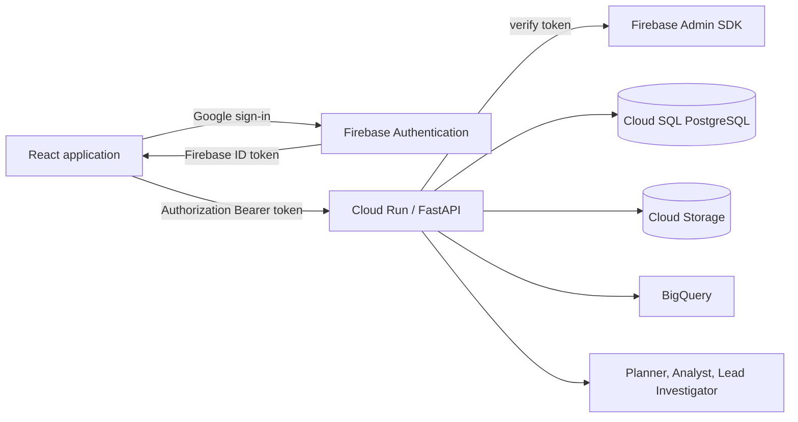

# Authentication and ownership plan

## Goal

Turn SourceLens from a public portfolio application into a multi-user product where each person can connect sources, run investigations, review briefs, and access a private notebook without exposing another person's data.

Authentication is not a visual sign-in layer. It establishes the ownership boundary used by every API, database query, object-store path, agent run, and audit event.

## Product decision

Use **Firebase Authentication** for Google sign-in and optional email/password sign-in later. The React application obtains a Firebase ID token; the FastAPI application verifies that token with the Firebase Admin SDK on every protected request.

The backend derives identity from the verified token. The browser must never submit an `owner_user_id`, and requests must never be authorised from a display name, email address, or client-supplied source identifier alone.

Initial model:

| Concept | First release |
| --- | --- |
| Account | One Firebase user maps to one SourceLens user row. |
| Ownership | A user owns their sources, investigations, notebook entries, and review feedback. |
| Collaboration | Deferred. Data models retain a `workspace_id` so shared workspaces can be added without a destructive migration. |
| Sign-in | Google sign-in first. Anonymous access is removed from protected product routes. |
| Product data | Existing portfolio/reference data becomes a read-only shared starter source, never another user's private source. |

## Decisions agreed during review (24 September 2026)

These sit on top of the plan below. Where they differ from it, this section wins.

### Additions

1. **Lock down `POST /api/setup/sample`.** It currently lets anyone reset the whole database without signing in. Remove it or restrict it before anything else.
2. **Stop the agent using an unselected upload.** `_resolve_uploaded_source` in `investigator.py` falls back to the first uploaded source it finds; remove that fallback.
3. **Testing uses real services:** BigQuery, Qdrant and real model calls.
4. **Cloud SQL start/stop commands:** `make db-start`, `make db-stop`, `make db-status`.
5. **`GOOGLE_SERV.md`** records Google Cloud services, costs, constraints, reminders and commands.

### Changes to this plan

1. **No staging environment.** Migration step 8 becomes: enable `AUTH_REQUIRED=true` in production.

### Settled details the plan left open

| Item | Decision |
| --- | --- |
| Cloud SQL instance | `sourcelens-db`, PostgreSQL 15, `db-f1-micro`, 10 GB SSD, `us-central1`, daily backups at 03:00 |
| Database and user | Database `sourcelens`, app user `sourcelens_app` |
| Database password | Secret Manager secret `sourcelens-db-password`; runtime service account has read access |
| Cloud Run access | Runtime service account has `roles/cloudsql.client` |
| Running cost | Instance is stopped when not in use; stopping keeps all data |

### Considered and rejected

- Firestore or Neon instead of Cloud SQL. Cloud SQL stays.
- A separate test database. Not part of this plan.
- A "Try as guest" button (Firebase anonymous sign-in). Google sign-in only, as the plan says.

### Deferred

- Per-user model budget and run limits. The budget and run cap stay global for now.

### Resolved

- **Private connection to Cloud SQL (follows the plan).** The instance has a private address (`10.113.0.3`) on the `default` network, and Cloud Run reaches it through Direct VPC egress (`--network=default --subnet=default --vpc-egress=private-ranges-only`). The locked public address is kept so a laptop can run migrations and tests through the authenticated Cloud SQL connector; no networks are allow-listed.

## Implementation record (24 September 2026)

| Plan item | Where |
| --- | --- |
| Token verification (`CurrentUser`, `require_user`, signature, issuer, audience, expiry, revocation) | `src/sourcelens/auth.py` |
| `AUTH_REQUIRED` transition flag: without a token, requests act as the system/demo owner while false | `auth.py`, `config.py` |
| Schema, ownership columns, indexes, system/demo owner | `migrations/versions/0001_ownership_schema.py` (Alembic) |
| Owner-scoped store methods; 404 for anything not owned | `src/sourcelens/store.py`, `main.py` |
| Portfolio records moved to the system/demo owner (2 investigations, 3 usage rows, starter source) | `scripts/import_portfolio_data.py` (`make db-import-portfolio`) |
| Tenant-scoped raw files `users/<user_id>/sources/<source_id>/<version_id>/` with URI, hash, version, status and owner in PostgreSQL | `sources.py` `store_source_version`, table `source_versions` |
| Agents see only the owner's sources plus the shared starter source | `investigator.py` |
| Browser sign-in, fresh token on every call, avatar and sign-out menu | `frontend/src/auth.tsx`, `firebase.ts`, `api.ts`, `App.tsx` |
| Per-user rate limits on investigations and uploads | `ratelimit.py` (20 investigations and 30 uploads per user per hour) |
| Audit events (auth failures, access denials, rate limits) without raw tokens | table `audit_events`, `store.audit` |
| Cross-user test suite, plan cases 1–8 | `tests/test_auth.py` |
| Production: Cloud SQL over private network, secrets from Secret Manager, `AUTH_REQUIRED=true` | `scripts/deploy_cloud_run.sh` |

Implementation details the plan implied but didn't spell out:

- **Source versions.** Test case 8 needs a later version of an existing source, so `POST /api/sources/{source_id}/versions` uploads one and `GET /api/sources/{source_id}/versions` lists versions with their manifests. Investigations record `source_version_id` in their scope, so notebook snapshots keep the version they used.
- **`GET /api/me`** returns the verified caller, for the frontend and tests.
- **Test data.** Tests use the live `sourcelens` database, BigQuery and the raw bucket. Each test creates its own users (`firebase_uid` starting `test-`) and deletes all their rows and stored objects afterwards. Audit rows from tests remain as an audit trail.
- **Test tokens.** Signed with a test key and checked by the real Firebase Admin SDK; only Google's public-certificate download and the revocation user lookup are replaced.
- **Removed:** `POST /api/setup/sample` and the start-up restore of every archived source from Cloud Storage; PostgreSQL is the source of truth.
- **Not done:** Galileo audit export. `GALILEO_*` variables exist in `.env.example`, but Galileo is not wired into the code; audit events go to the `audit_events` table.

## Target architecture



Cloud Run uses a dedicated runtime service account. Firebase verifies user identity; it does not grant the application's service account authority to read arbitrary customer data. BigQuery access is granted deliberately to the runtime service account for each customer dataset, then recorded under the source owner.

## Data model

Move application state from ephemeral SQLite to Cloud SQL PostgreSQL before exposing private accounts on Cloud Run.

```sql
CREATE TABLE users (
  user_id UUID PRIMARY KEY,
  firebase_uid TEXT UNIQUE NOT NULL,
  email TEXT,
  display_name TEXT,
  created_at TIMESTAMPTZ NOT NULL,
  last_seen_at TIMESTAMPTZ NOT NULL
);

CREATE TABLE workspaces (
  workspace_id UUID PRIMARY KEY,
  name TEXT NOT NULL,
  created_at TIMESTAMPTZ NOT NULL
);

CREATE TABLE workspace_members (
  workspace_id UUID NOT NULL REFERENCES workspaces,
  user_id UUID NOT NULL REFERENCES users,
  role TEXT NOT NULL CHECK (role IN ('owner', 'editor', 'viewer')),
  PRIMARY KEY (workspace_id, user_id)
);
```

Add both fields to all product-owned tables:

```sql
ALTER TABLE data_sources ADD COLUMN owner_user_id UUID REFERENCES users;
ALTER TABLE data_sources ADD COLUMN workspace_id UUID REFERENCES workspaces;
ALTER TABLE investigations ADD COLUMN owner_user_id UUID REFERENCES users;
ALTER TABLE investigations ADD COLUMN workspace_id UUID REFERENCES workspaces;
ALTER TABLE notebook_entries ADD COLUMN owner_user_id UUID REFERENCES users;
ALTER TABLE notebook_entries ADD COLUMN workspace_id UUID REFERENCES workspaces;
ALTER TABLE usage_ledger ADD COLUMN owner_user_id UUID REFERENCES users;
```

For the individual-account release, set `owner_user_id` to the authenticated user and leave `workspace_id` null. Add `NOT NULL` constraints only after the existing portfolio data has been migrated to a dedicated system/demo owner.

Every lookup must include ownership. Examples:

```sql
SELECT * FROM investigations
WHERE investigation_id = :investigation_id
  AND owner_user_id = :authenticated_user_id;

SELECT * FROM data_sources
WHERE owner_user_id = :authenticated_user_id
ORDER BY created_at DESC;
```

Use a `404` response for an object that either does not exist or is not owned by the caller. That avoids confirming another user's identifiers.

## API implementation

### 1. Verify Firebase tokens

Add `firebase-admin` to the Python dependencies. Configure the Admin SDK through Cloud Run's runtime service account and the Firebase project ID; no downloaded service-account JSON file belongs in the repository or browser.

Create `src/sourcelens/auth.py`:

```python
from dataclasses import dataclass
from fastapi import Header, HTTPException
from firebase_admin import auth

@dataclass(frozen=True)
class CurrentUser:
    firebase_uid: str
    email: str | None
    display_name: str | None
    user_id: str

async def require_user(authorization: str | None = Header(default=None)) -> CurrentUser:
    if not authorization or not authorization.startswith("Bearer "):
        raise HTTPException(401, "Sign in to continue")
    try:
        claims = auth.verify_id_token(authorization.removeprefix("Bearer "))
    except Exception as exc:
        raise HTTPException(401, "Your session has expired. Sign in again.") from exc
    return upsert_user_from_claims(claims)
```

Inject `CurrentUser` into every protected route. Pass it into store methods rather than reading a global request context. This makes ownership visible in code review and easy to exercise in tests.

### 2. Protect product endpoints

Protect these routes:

| Route family | Rule |
| --- | --- |
| `/api/sources*` | List, preview, connect, upload, and inspect only sources owned by the user. |
| `/api/investigations*` | Create against owned sources; retrieve, refine, and review only owned investigations. |
| `/api/notebook` | Return only the user's notebook entries. |
| `/api/health` | Remains public and exposes no user data. |

When an investigation starts, store `owner_user_id` before invoking agents. Agent tools receive only sources permitted for that owner. Evidence retrieval filters by source ownership and source version.

### 3. Make the browser sign in

Add Firebase Web SDK configuration through public Vite variables:

```text
VITE_FIREBASE_API_KEY=
VITE_FIREBASE_AUTH_DOMAIN=
VITE_FIREBASE_PROJECT_ID=
VITE_FIREBASE_APP_ID=
```

Create a small auth provider that:

1. Restores the Firebase session on page load.
2. Shows a clear sign-in page when there is no session.
3. Provides Google sign-in and sign-out.
4. Retrieves a fresh ID token before each API call.
5. Adds `Authorization: Bearer <token>` to the API client.

The top navigation should show the signed-in person's avatar/name and a sign-out menu. It should not display account data before the session has loaded.

## Raw-file and connection isolation

Store uploaded objects under a tenant-scoped prefix:

```text
gs://<raw-bucket>/users/<user_id>/sources/<source_id>/<version_id>/original.ext
gs://<raw-bucket>/users/<user_id>/sources/<source_id>/<version_id>/records.jsonl
gs://<raw-bucket>/users/<user_id>/sources/<source_id>/<version_id>/manifest.json
```

Persist the exact object URI, content hash, source version, ingestion time, extraction status, and owner in PostgreSQL. The API never accepts a raw Cloud Storage URI from the browser as proof of access.

For BigQuery connections, persist project, dataset, location, verified table metadata, and the owner. Before connecting, display the Cloud Run runtime service-account email and required permissions. Verification must re-check access before marking the source connected.

## Migration sequence

1. Provision Cloud SQL PostgreSQL and a private Cloud Run connection.
2. Add a database migration tool such as Alembic; establish the new schema.
3. Add Firebase Authentication and configure Google as a sign-in provider.
4. Add backend token verification behind a `AUTH_REQUIRED=false` transition flag.
5. Migrate current portfolio records to a dedicated system/demo owner; preserve source manifests and notebook snapshots.
6. Add ownership columns, indexes, and owner-scoped store methods.
7. Switch the frontend to sign-in and authenticated API requests.
8. Enable `AUTH_REQUIRED=true` in staging, then production.
9. Retire the public unauthenticated product endpoints; retain only `/api/health` publicly.

Do not deploy public authentication while application data is still stored in Cloud Run's `/tmp` filesystem. That would present private accounts without durable private state.

## Security controls

- Verify Firebase ID token signature, issuer, audience, expiry, and revocation status server-side.
- Treat user-uploaded data as untrusted content; never follow instructions embedded in documents, cells, or database text.
- Use parameterised SQL and allowlisted tables for the shared commerce warehouse.
- Keep Firebase private credentials and database passwords in Secret Manager, never in `.env` files committed to source control or Vite variables.
- Rate-limit sign-in-adjacent and expensive investigation routes by authenticated user ID.
- Record authentication failures, source-access denials, owner ID, investigation ID, and model spend in Galileo/local audit events without logging raw ID tokens.
- Support account deletion later by deleting the user’s Cloud SQL rows and scoped Cloud Storage objects through a deliberate, auditable workflow.

## Test plan

Add an authentication test fixture that creates signed Firebase token claims without calling the external service. Cover:

1. An unsigned request receives `401` from every protected route.
2. User A can create and retrieve their source, investigation, and notebook entry.
3. User B receives `404` for User A's source, investigation, notebook entry, manifest, and raw-file metadata.
4. User A cannot run an investigation against User B's source ID.
5. An expired, malformed, wrong-audience, or revoked token receives `401`.
6. A BigQuery source is saved only after successful verification under the authenticated owner.
7. Every agent retrieval query is constrained to the current owner’s source set.
8. A notebook snapshot preserves the original user and source version even when a later source version is uploaded.

## Definition of done

- A user can sign in with Google and sign out.
- No product data is returned without a verified token.
- Sources, investigations, notebook entries, raw files, and usage records are isolated by owner.
- State is durable across Cloud Run revisions and scale-to-zero events.
- Cloud Run receives only secrets from Secret Manager and uses least-privilege service accounts.
- The cross-user authorization test suite passes in CI.
- Galileo traces correlate authenticated investigation activity without exposing raw tokens or unrestricted source content.
