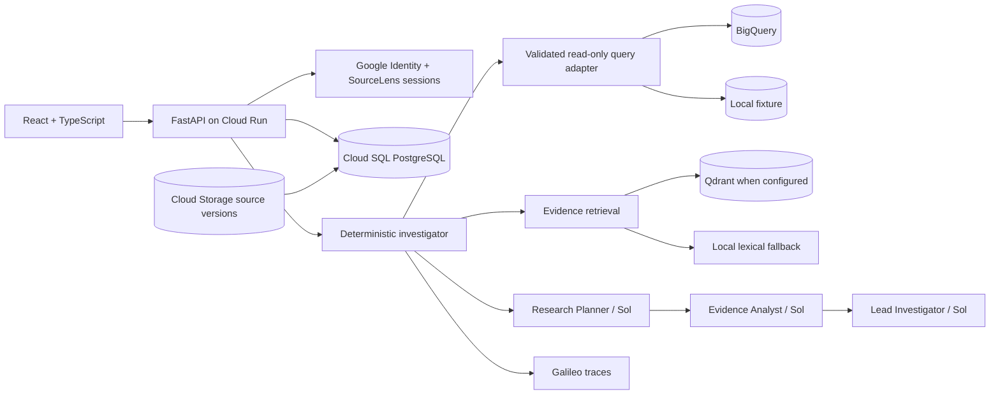

# SourceLens

**An agent-led workspace for investigating business performance and customer feedback with evidence you can inspect.**

SourceLens helps a product manager move from a broad business question to a reviewable conclusion. The user selects a source and asks a question; SourceLens scopes the investigation, runs controlled analysis, evaluates competing explanations, retrieves supporting evidence, and produces a structured brief. The user can inspect the work, guide another pass, and save an accepted, edited, or rejected conclusion to a versioned notebook.

**Live application:** [sourcelens-tdghggm6ma-uc.a.run.app](https://sourcelens-tdghggm6ma-uc.a.run.app)

[Product brief](PRODUCT.md) · [Build and cost plan](BUILD.md) · [Codebase review](CODEBASE_REVIEW.md) · [Latest eval artifact](artifacts/evals/portfolio-eval.json)

## Product position

The initial user is a product manager investigating a change in customer experience or business performance. The evidence may span sales, inventory, returns, ratings, and customer comments. The user knows the decision they need to inform but may not know which comparisons or follow-up tests will explain the change.

**Job to be done:** Help me understand what changed, investigate credible explanations, and reach a conclusion I can verify without manually organising every record or directing every analytical step.

SourceLens currently runs as a **one-user portfolio application**. Production access is restricted to one approved Google account. The storage and authorization model remains owner-scoped so the system can support additional accounts later without redesigning data isolation.

## Why an agent?

The model interprets varied language, proposes useful hypotheses, weighs competing explanations, and writes a clear, qualified brief. Deterministic software resolves entities, executes calculations, validates read-only SQL, enforces limits, renders artifacts, persists versions, and maintains provenance.

The product loop is:

> Ask a question → test explanations → inspect evidence → review the conclusion → retain the decision.

This division keeps model judgment where it is useful while preventing the model from inventing source access, calculations, citations, or write operations.

## Current experience

- **Modern conversation workspace:** a focused question composer, source selector, suggested starting points, and a persistent history of investigations.
- **Visible investigation:** the question, agent activity, calculations, evidence, limitations, and recommended next test remain connected.
- **Sources:** upload CSV, XLSX, PDF, DOCX, or DOC files, or connect a BigQuery dataset through a guided read-only setup.
- **Notebook:** accept, edit and accept, or reject a brief; every review saves an immutable snapshot with two user ratings.
- **Evidence inspection:** quantitative findings link to stored query artifacts and qualitative findings link to exact source excerpts.

The reference investigation asks why revenue and sentiment declined for Nova X300. SourceLens decomposes the change into units and realised price, compares returns and availability, retrieves customer comments, identifies the strongest supported explanation, and preserves the distinction between association and causation.

## Architecture



### Agent workflow

SourceLens uses three bounded OpenAI Agents SDK roles with typed outputs:

1. **Research Planner — `gpt-5.6-sol`:** translates the brief and source catalog into testable hypotheses and a bounded plan.
2. **Evidence Analyst — `gpt-5.6-sol`:** challenges the computed findings, identifies counterevidence and gaps, and recommends the next useful check.
3. **Lead Investigator — `gpt-5.6-sol`:** synthesizes the validated plan, metrics, findings, and evidence assessment into the decision brief.

Python owns the workflow state, source resolution, controlled SQL, calculations, artifacts, evidence references, review state, and persistence. The roles exchange structured outputs instead of an unbounded transcript.

### Authentication and ownership

The browser uses Google Identity Services to obtain a short-lived Google ID credential. The API verifies its issuer, audience, signature, expiry, verified email, and allowed account, then exchanges it for a random SourceLens session:

- The session value is stored only in a `Secure`, `HttpOnly`, `SameSite=Lax` cookie.
- Only a SHA-256 hash is stored in Cloud SQL.
- Sessions expire after five days and can be revoked immediately at sign-out.
- Cookie-authenticated writes require a double-submit CSRF token.
- Sources, investigations, notebook entries, uploaded objects, and usage records remain owner-scoped.
- Only `/api/health` is public; product endpoints require an authenticated session.

The database still contains legacy Firebase naming and a compatibility bearer-token path from the earlier authentication implementation. These are scheduled for removal after the direct Google-session release is verified.

### Data and provenance

The shared reference warehouse contains generated data for four products:

| Table | Rows | Purpose |
| --- | ---: | --- |
| `products` | 4 | Product identity and pricing |
| `sales_monthly` | 192 | Monthly channel aggregates |
| `sales_lines` | 124,747 | Transaction-grain scale data |
| `inventory_monthly` | 96 | Availability and stockout days |
| `returns_monthly` | 96 | Returns and quality-coded returns |
| `feedback` | 1,084 | Ratings, text, themes, provenance, and hashes |

The same version exists as a local deterministic fixture and in BigQuery. Uploaded originals, normalized records, and manifests are retained by owner and source version in Cloud Storage. Notebook snapshots embed the investigation version the user reviewed.

## Observability and cost

Galileo is the external tracing platform. One investigation is a Galileo session; each initial run or refinement is a complete workflow trace containing the Planner, Evidence Analyst, Lead Investigator, model generations, and nested spans.

Cloud SQL independently records each successful model call with:

- model and role;
- input and output tokens;
- elapsed time;
- estimated model cost;
- investigation and owner.

The app keeps working if Galileo is unavailable. Local investigation events and eval JSON remain the portable audit trail. Production logs must never include credentials, raw authentication tokens, or unrestricted source contents.

Current cost controls include a configurable model budget, live-investigation ceiling, per-user request limits, BigQuery dry runs, a 10 GiB maximum-bytes-billed limit, allowlisted tables, and bounded query results. The current budget ledger is global and should be treated as a portfolio safeguard rather than a general multi-user billing system.

## Run locally

Prerequisites: Python 3.11+, `uv`, Node 22+, and `gcloud` authenticated as the project owner. Cloud SQL must be running.

```bash
cp .env.example .env
cp frontend/.env.example frontend/.env
make install
make db-start
make db-migrate
npm --prefix frontend run build
make dev
```

In another terminal, run the Vite frontend for live development:

```bash
make frontend
```

Open `http://localhost:5173`. `make dev` injects the allowed owner email and retrieves the database password from Secret Manager. Local `.env` supplies the public Google OAuth client ID plus optional OpenAI, Galileo, and Qdrant settings. Never commit `.env`.

Important configuration:

```dotenv
SOURCELENS_COMPLEX_MODEL=gpt-5.6-sol
SOURCELENS_SIMPLE_MODEL=gpt-5.6-sol
SOURCELENS_LIVE_AGENT=1
SOURCELENS_WAREHOUSE=bigquery
GOOGLE_OAUTH_CLIENT_ID=...
OPENAI_API_KEY=...
GALILEO_API_KEY=...
GALILEO_PROJECT=sourcelens
GALILEO_LOG_STREAM=log-stream-sourcelens
```

## Validate

```bash
uv run ruff check src tests evals scripts migrations
make test
npm --prefix frontend test -- --run
npm --prefix frontend run build
```

`make test` intentionally uses Cloud SQL, BigQuery, and Cloud Storage. Tests create owner-scoped records and remove their users and bucket objects afterwards. The paid live-model test is excluded unless explicitly requested:

```bash
make test-live
```

Latest validation on 26 September 2026:

- Backend integration suite: **40 passed**, 1 paid live-model test skipped.
- Frontend: **7 tests passed**.
- Python lint, TypeScript, and Vite production build: passed.
- Historical bounded eval: baseline 4/5, calibrated rerun 5/5. These artifacts predate the owner-aware persistence migration; repair and rerun the eval runner before making a new quality claim.

## Deploy

Cloud Run configuration is defined in `scripts/deploy_cloud_run.sh` and invoked with:

```bash
make deploy
```

The script verifies the active Google account, checks that Cloud SQL is running, applies migrations, grants the runtime service account its required roles, attaches available secrets, builds the container, and deploys with:

- `AUTH_REQUIRED=true` and one allowed account;
- live Sol calls enabled;
- BigQuery and Cloud Storage configured;
- OpenAI and Galileo keys from Secret Manager;
- Direct VPC egress to Cloud SQL;
- zero minimum and one maximum instance;
- eight concurrent requests per instance.

The service is deliberately public at the Cloud Run layer because the application performs its own Google sign-in and session authorization.

## Current boundaries

- The integrated commerce analysis compares Q3 and Q4 2025. General date parsing is not yet implemented.
- A newly connected arbitrary BigQuery dataset is verified and sampled for an initial bounded profile; it does not yet receive unrestricted generated SQL.
- Uploaded-source investigations profile at most 500 records and retain bounded excerpts.
- Investigation work currently runs inside the Cloud Run web process. A restart can interrupt a run; durable task execution or stale-run recovery remains release hardening.
- Qdrant is optional and the application falls back to deterministic local retrieval when it is unavailable.
- Usage metrics are persisted but do not yet have an authenticated product dashboard.
- The run and model-spend ceilings are global portfolio controls. Refinements share the same investigation ID.

The detailed findings and update sequence are maintained in [CODEBASE_REVIEW.md](CODEBASE_REVIEW.md).
