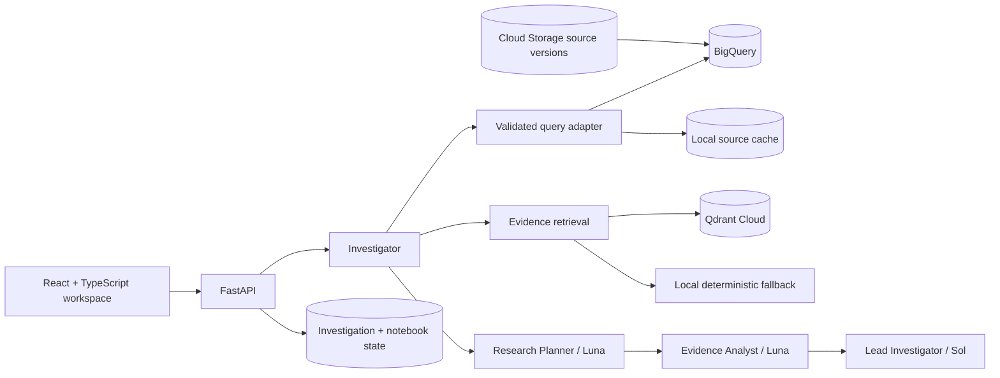

# SourceLens

**An agent-led evidence workspace for investigating business performance and customer feedback.**

SourceLens is a working investigation workspace. A user states the decision they need to understand; an agent team scopes the question, runs controlled analysis, evaluates alternative explanations, retrieves source evidence, and assembles a visual brief. The user can redirect the analysis, inspect comments and SQL, then accept, reject, or edit and accept the result with two 1–5 ratings. Every reviewed version becomes an immutable notebook entry.

**Live demo:** [sourcelens-tdghggm6ma-uc.a.run.app](https://sourcelens-tdghggm6ma-uc.a.run.app)

[Product brief](PRODUCT.md) · [Architecture, roadmap, and cost model](BUILD.md) · [Latest eval report](artifacts/evals/portfolio-eval.json)

## 1. User

The initial user is a product manager investigating a change in customer experience or business performance across products and periods. They know the decision they need to inform, but may not know which data, comparisons, or follow-up tests will explain it.

**Job to be done:** Help me understand what changed, investigate credible explanations, and reach a conclusion I can verify without manually organising every record or directing every analytical step.

## 2. Problem

The evidence for a product decision rarely lives in one place. Feedback describes experiences; sales shows commercial outcomes; price, inventory, and returns provide context. Analysts often reconcile exports, request SQL, read comments, build comparisons, and assemble a report by hand.

A one-shot summary is insufficient. It can miss relevant dimensions, use unrepresentative comments, or express a plausible explanation as fact. SourceLens reduces both analysis effort and verification effort by maintaining the scope, actions, calculations, evidence, visuals, and human judgment as one versioned investigation.

## 3. Why AI?

The model interprets varied language, proposes useful hypotheses, weighs competing explanations, and writes a clear, qualified brief. Deterministic software resolves entities, executes calculations, validates read-only SQL, enforces budgets, renders charts, persists versions, and maintains provenance.

The product value comes from the full loop:

**Surface a pattern → show evidence → propose a useful direction → incorporate the user's judgment → update the artifacts.**

This is more than single-shot prompting because the system has durable data access, runs controlled tests, exposes its real actions, keeps artifacts synchronized, and records reviewed outcomes. The portfolio still treats that differentiation as a hypothesis to measure against a general-purpose chat baseline.

## 4. Experience

The workspace combines three surfaces:

- **Conversation and activity:** the starting brief, real tool actions, expandable SQL, assumptions, and a follow-up direction control. It does not expose private chain-of-thought.
- **Live analysis:** a research brief, revenue and feedback visuals, observations, interpretations, next tests, limitations, and evidence links.
- **Notebook:** dated tiles for accepted, edited-and-accepted, and rejected briefs. Opening a tile shows the complete saved analysis and ratings.

The initial demonstration investigates Nova X300. It independently decomposes revenue into units and realised price, compares returns and availability, retrieves exact customer comments, identifies quality as the strongest supported hypothesis, and states that the available evidence does not prove causation.

## 5. Data and audit trail

The reference commerce source provides a coherent business dataset with:

| Table | Rows | Purpose |
| --- | ---: | --- |
| `products` | 4 | Product identity and pricing |
| `sales_monthly` | 192 | Monthly channel aggregates |
| `sales_lines` | 124,747 | Transaction-grain scale data |
| `inventory_monthly` | 96 | Availability and stockout days |
| `returns_monthly` | 96 | Returns and quality-coded returns |
| `feedback` | 1,084 | Ratings, text, themes, source metadata, and hashes |

The same source version exists locally for deterministic development and in BigQuery for cloud query execution. Cloud Storage retains the database and provenance manifest at:

- `gs://gemini-enterprise-learning-sourcelens-raw/reference/v1/sourcelens.db`
- `gs://gemini-enterprise-learning-sourcelens-raw/reference/v1/source-manifest.json`

Every comment has a stable source ID and content hash. Quantitative artifacts retain the SQL and result rows used by the finding. Notebook snapshots embed the exact investigation version that the user reviewed.

The connector boundary is the common evidence contract, so later adapters can map database dumps, support exports, procurement records, publications, or other sources without changing the investigation and review model.

## 6. Architecture



### Agentic design

The investigation uses **three OpenAI Agents SDK roles** with typed handoffs:

1. **Research Planner — Luna:** translates the brief and source catalog into hypotheses and a bounded analysis plan.
2. **Evidence Analyst — Luna:** challenges the computed findings, identifies counterevidence and gaps, and recommends the next useful check.
3. **Lead Investigator — Sol:** synthesizes the validated plan, metrics, findings, and evidence assessment into the decision brief.

Python owns the investigation state machine: resolve scope, run the revenue decomposition, evaluate returns and availability, retrieve customer evidence, assemble typed findings and artifacts, coordinate the agent handoffs, and persist the reviewed result. Query execution, arithmetic, citations, budgets, and notebook snapshots remain deterministic. This gives each role a distinct responsibility without allowing models to invent data access or mutate source systems.

The roles share versioned, structured outputs rather than an unbounded transcript. Each handoff is recorded as an investigation event, and each model call has separate usage accounting.

- **Sol (`gpt-5.6-sol`)** leads complex evidence-backed synthesis.
- **Luna (`gpt-5.6-luna`)** handles planning and evidence assessment, and remains the preferred model for future high-volume extraction work.
- **BigQuery** performs analytical computation near the data with allowlisted tables, dry runs, a 10 GiB per-query billing ceiling, and bounded results.
- **Qdrant** is a derived semantic index. The current index uses a deterministic 256-dimensional hash embedding so it remains free and reproducible. Local lexical retrieval keeps the app usable when Qdrant is unavailable.
- **Cloud Storage** is the retained raw-source layer. Qdrant and application state are not the raw system of record.
- **SQLite** stores investigation state and immutable notebook revisions in the current deployment. A durable managed state store is required before multi-instance production use.

### Observability: Galileo

**Galileo is the selected observability platform.** Each live investigation will be grouped by investigation ID and record the model, prompt/workflow version, token usage, estimated cost, latency, tool/action sequence, completion status, and user review outcome. Prompt and evidence content must follow the source-retention policy; production tracing should redact credentials and avoid capturing unrestricted raw records.

Deterministic application events and eval JSON remain the portable audit layer when Galileo is unavailable. Galileo export is activated only when `GALILEO_API_KEY`, `GALILEO_PROJECT`, and `GALILEO_LOG_STREAM` are configured. The current local eval artifacts remain authoritative for the reported 4/5 → 5/5 iteration until that external connection is enabled.

## 7. Run locally

Prerequisites: Python 3.11+, `uv`, and Node 22+.

```bash
cd sourcelens
cp .env.example .env
uv sync --extra dev
npm --prefix frontend install
uv run sourcelens-reference-data --reset
npm --prefix frontend run build
uv run sourcelens-api
```

Open `http://localhost:8000`. The default path uses the local warehouse and deterministic brief, so it works without API or cloud credentials.

Enable the live Sol refinement and BigQuery adapter in `.env`:

```dotenv
SOURCELENS_LIVE_AGENT=1
SOURCELENS_WAREHOUSE=bigquery
OPENAI_API_KEY=...
GOOGLE_CLOUD_PROJECT=gemini-enterprise-learning
SOURCELENS_BIGQUERY_DATASET=sourcelens_demo
```

Application Default Credentials must belong to the intended Google account. Never commit `.env`.

## 8. Cloud data setup

The setup scripts verify that the active `gcloud` account is `abanerje.08@gmail.com` before provisioning.

```bash
bash scripts/provision_gcp.sh
uv run python scripts/load_bigquery.py
gcloud storage cp data/sourcelens.db data/source-manifest.json \
  gs://gemini-enterprise-learning-sourcelens-raw/reference/v1/
```

The current cloud resources are:

- Project: `gemini-enterprise-learning`
- Region: `us-central1`
- BigQuery dataset: `sourcelens_demo`
- Raw bucket: `gemini-enterprise-learning-sourcelens-raw`

A live adapter verification processed 3,600 bytes and returned the expected four-product revenue aggregate.

## 9. Qdrant setup, reactivation, and recovery

Set the free-cluster endpoint and key, then run the idempotent builder:

```dotenv
QDRANT_URL=https://your-cluster-url
QDRANT_API_KEY=...
QDRANT_COLLECTION=sourcelens-feedback-v1
```

```bash
uv run python scripts/index_qdrant.py
```

The command creates `sourcelens-feedback-v1`, records embedding metadata, creates the `product_id` payload index, and upserts 1,084 deterministic point IDs. Re-running it rebuilds or refreshes the derived index from the retained source snapshot.

Before a demonstration, open Qdrant Cloud and reactivate a suspended free cluster. If the cluster was deleted, create a replacement, update the two secrets, and rerun the same index command. Verify the reported record count and one product-filtered search. If the embedding implementation changes, use a new collection version rather than mixing vectors. Do not generate artificial traffic to keep a free cluster awake.

## 10. Evaluation

Run deterministic checks:

```bash
uv run ruff check src tests evals scripts
uv run pytest -q
npm --prefix frontend run build
npm --prefix frontend test -- --run
```

Run the bounded live Sol evaluation only when an API key and evaluation budget are available:

```bash
OPENAI_AGENTS_DISABLE_TRACING=1 uv run python -c \
  "from evals.run_portfolio_eval import main; main()"
```

Measured on 24 September 2026:

| Run | Result | Estimated model cost | What changed |
| --- | ---: | ---: | --- |
| Baseline, 5 cases | 4/5 | $0.0994 | A valid “not causation” caveat exposed a narrow string-based evaluator. |
| Calibrated rerun, same 5 cases | 5/5 | $0.0985 | The evaluator recognizes equivalent causal caveats. Product behavior was unchanged. |

The ten evaluation investigations cover direct decline analysis, price versus quality, stockout testing, missing-evidence behavior, customer voice, citation resolution, bounded findings, and visible tool paths. This is a small portfolio eval, not a production certification. Galileo is the selected production observability sink and needs its API key, project, and log stream before trace export can be activated.

## 11. Cost and controls

The agreed build envelope is **$10–$12 for 10–15 live investigations, including 5–10 eval investigations**. This implementation used ten eval investigations plus one live smoke investigation. The two recorded eval rounds cost an estimated **$0.1979** in model usage; the smoke investigation cost about **$0.0195**. Cloud storage and query usage remain small at this fixture size.

Controls include:

- Live model run count and model-cost ledgers.
- A configurable `$9` model budget and 15-run ceiling.
- Parsed, read-only, single-statement SQL over six allowlisted tables.
- BigQuery dry runs, maximum bytes billed, and bounded returned rows.
- No autonomous external business actions.
- Reference data only on the public application.

Provider prices can change; [BUILD.md](BUILD.md#8-cost-assumptions-and-verified-unit-rates) records the planning assumptions rather than presenting them as permanent rates.

## 12. Current boundaries

The current release supports a connected BigQuery warehouse and file ingestion for CSV, XLSX, PDF, DOCX, and DOC through `/api/sources`. Uploaded originals are retained with their content hash, metadata, normalized records, and a provenance manifest. Questions that name an uploaded file route to that source and produce a bounded profile, cited record excerpts, visible distributions, numeric ranges, findings, and a reviewable brief. The warehouse period comparison is currently fixed to Q3 versus Q4 2025; user-defined date parsing and semantic field mapping for uploaded sources remain later work.

Cloud Run revision `sourcelens-00007-d4f` is deployed in `us-central1` at [the live application](https://sourcelens-tdghggm6ma-uc.a.run.app). It scales to zero, is capped at one instance, uses the dedicated `sourcelens-runtime` service account, and queries the provisioned BigQuery dataset. Uploaded originals, normalized records, and provenance manifests are archived in Cloud Storage and restored into the source catalog after an instance restart. The public build uses the deterministic investigation path so its unauthenticated endpoint cannot consume the OpenAI model budget. The full Planner → Evidence Analyst → Lead Investigator workflow is enabled through runtime configuration.

The deployed notebook and investigation state use ephemeral SQLite and may reset when Cloud Run replaces or scales down the instance. A durable managed state store, endpoint rate limiting, and Galileo/Qdrant credentials remain release-hardening work. Qdrant Cloud and Galileo cannot be activated until their service credentials exist.

The prepared first deployment uses `bash scripts/deploy_cloud_run.sh`. It verifies the required Google account, creates a least-purpose runtime service account, grants read access to the portfolio data, scales to zero, caps the service at one instance, and deploys the deterministic investigation path publicly. Live Sol mode remains local until a durable cross-restart spend counter or protected endpoint is added; this avoids placing an unrestricted paid model endpoint on a no-auth public service.


## Workspace navigation

The home page is `/`. A text-only top navigation leads to `/investigations`, `/sources`, and `/notebook`; each investigation has a reloadable `/investigations/{id}` address. Home contains the question composer and a selector for existing sources. Source setup is centralized on Sources.

File ingestion follows preview → confirm: preview extraction does not register or archive a source. BigQuery setup explains project ID, dataset ID, location, and the runtime service account's permissions. Verification checks dataset location, lists tables, and reads a bounded row preview; saving repeats verification before recording a connected source. Arbitrary BigQuery sources currently use that bounded snapshot for the initial profile, rather than supporting unrestricted SQL against new schemas. The original integrated commerce warehouse retains its controlled SQL workflow.
