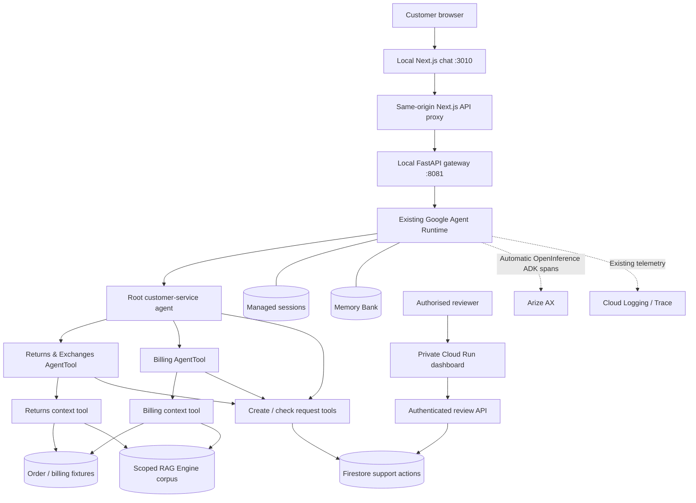

# BUILD PLAN — Tarnfield Customer Support Assistant

**Product owner:** Abhinav Banerjee

**Last verified:** 1 October 2026

**Scenario:** Tarnfield Running Co., a fictional running retailer using fixture orders.

**Open the customer app:** [Tarnfield Care chat](http://127.0.0.1:3010). This is the current local product frontend. Start the UI and gateway using [the frontend guide](frontend/README.md); public customer hosting remains a later delivery stage.

The product helps a customer get a grounded returns, exchanges or billing answer, then file a durable request when a person must decide the next step. AI interprets the question and applies retrieved policy; deterministic code supplies records, calculates dates and enforces workflow transitions. No code executes refunds or changes commerce orders.

The three-agent backend is deployed to the existing Google Agent Runtime in `us-central1`. The Next.js customer chat runs locally on port **3010**, through a Python gateway on **8081**, against that deployed backend. The separate private Cloud Run service hosts **Support Operations**, the human reviewer dashboard. Automatic Arize AX traces are deployed and verified. Public customer hosting, broad behavioural gates, hosted Arize evaluations and operational alerts remain open.

## 1. Users, problem and value

| User | Job and current friction | Product value | Evidence still needed |
|---|---|---|---|
| Customer | Understand eligibility or a charge without finding several policy clauses or repeating their story | A concise sourced answer, saved conversation and a real review reference | Task completion, repeated-information rate and customer satisfaction |
| Support reviewer | Understand and decide a request without reconstructing the context | Order facts, policy evidence, an attributable decision and audit history in one queue | Reviewer time saved and agreement with agent recommendations |
| Product owner/operator | Know why a response failed and whether changes improve quality and economics | Trace each agent/model/tool hop; separate retrieval, reasoning and delivery failures | Repeated quality, latency and cost baselines; configured monitoring |

A representative question is: “I bought these shoes 40 days ago, wore them twice, and the sole split. Can I exchange them?” The answer depends on intent, order facts, general policy and product exceptions. That combination justifies an LLM for interpretation and explanation. A date calculation, order lookup, permission check or saved status does not need an LLM.

The north-star outcome is the **share of eligible support conversations that end in a grounded answer or correctly filed human-review request, without the customer repeating information**. It is a proposed measurement, not a result established by the current smoke checks.

## 2. Scope and release boundary

| Implemented | Deliberately outside the current release |
|---|---|
| Root plus Returns & Exchanges and Billing specialists | Autonomous refunds, exchanges or billing adjustments |
| Scoped retrieval from three policy PDFs | A real commerce, payment or CRM connector |
| Fixture order, invoice and charge lookups | Verified customer accounts and order ownership |
| Managed sessions and cross-session Memory Bank path | A deployed public customer frontend |
| Local customer chat with history, sources, stop/recovery and request status | Multi-instance gateway coordination and customer quotas |
| Firestore support requests and human decision workflow | Multi-reviewer IAP rollout and separate viewer/admin roles |
| Private Cloud Run reviewer dashboard | A warehouse, hosted Arize eval jobs or configured alerts |
| Automatic Arize AX tracing with content hidden by default | A complete retention/consent policy or proven latency SLA |

Returns and Exchanges remain one specialist: they share eligibility rules, order context and catalogue exceptions. Another agent would add routing and coordination without an evidenced customer benefit. Current model choices remain fixed while the measurement and architecture are evaluated.

## 3. Customer control, trust and failure handling

For a policy question, the root identifies the domain, delegates evidence gathering and judgement to the relevant specialist, and delivers the sourced ruling. The root owns the customer voice. Specialists return evidence to it rather than speaking directly to the customer.

For a proposed action, the customer confirms a human-review request. The assistant supplies a reference only after storage confirms the write. **Filed**, **approved** and **completed** are separate states. The reviewer makes the decision; the current application only records completion.

The customer chat provides genuine tool-progress labels, readable streaming answers, copy, conversation search, new conversations and preserved unsent drafts. It avoids invented reasoning displays. A source link inferred from a named policy is labelled **Referenced policy**; an excerpt is shown only when genuine metadata exists. Child retrieval events are often hidden by the deployed AgentTool boundary, so source chips do not prove that the browser received the retrieved passage.

| Failure or ambiguity | Customer experience and control | Remaining work |
|---|---|---|
| RAG unavailable or policy silent | Say the policy cannot be checked or does not answer; offer human review rather than invent a ruling | Broader refusal and retrieval-failure evaluations |
| Request write fails | Do not claim a request exists or issue an unconfirmed reference | Monitor failed writes and measure recovery |
| Stream stops or connection fails after dispatch | Retain confirmed request references; recover saved history before repeating an action | Measure recovery success across slow and interrupted turns |
| Customer selects Stop | Stop the display; the dispatched backend workflow may continue, guarded against another concurrent turn | A true cancellation contract if the runtime later supports it |
| Memory is delayed or conflicts with policy | Continue with current message and current evidence; memory never authorises a ruling | Delay distribution and explicit customer fallback testing |
| Reviewer uses a stale request version | Reject the update visibly instead of overwriting another decision | Multiple named reviewer rollout |
| Question is outside the documented domains | Explain the support boundary | Adversarial and cross-domain holdouts |

A signed browser cookie establishes anonymous conversation continuity. It does not verify customer identity or order ownership. The UI states that this is a portfolio demonstration with fictional orders.

## 4. Architecture and service boundaries

| Boundary | Decision and trade-off |
|---|---|
| Root and two specialist AgentTools | Domain judgement stays separate from customer delivery; extra model hops increase latency and cost |
| Consolidated context tools | Gather deterministic facts and scoped policy together so required context is harder to skip; the model still decides what evidence means |
| Next.js plus thin Python gateway | Reuse the deployed agents and managed sessions; no second LLM orchestrator or browser cloud credentials |
| Separate reviewer application | Customer tools have create/read capabilities; decision methods remain behind authenticated human access |
| Managed RAG, sessions and memory | Reduce infrastructure work for the small corpus; accept managed-service latency, eventual consistency and platform coupling |
| Arize plus Cloud telemetry | AI workflow diagnosis and infrastructure diagnosis have different jobs; preserve the shared tracer provider |

`get_returns_context(question, order_id, ...)` gathers order facts, calculated dates, returns clauses and product rules. `get_billing_context(question, order_id, invoice_id, ...)` gathers applicable order, charge, invoice and billing evidence. These tools are implemented. Repeated before/after quality and latency comparison remains open; consolidation did not eliminate root → specialist → root model work.

## 5. Conversation and memory authority

Managed sessions store the event history of one conversation. Memory Bank extracts useful facts across conversations, such as a contact preference. The root alone receives memory; specialists receive the current task and evidence.

| Information | Allowed use | Policy authority |
|---|---|---|
| Customer message, conversation history and memory | Understand intent, personalise and avoid asking for known details | Cannot override current policy |
| Deterministic order/payment records | Establish order and billing facts | Authority for those facts only |
| Current retrieved policy | Decide eligibility and payment rules | Policy source of truth |

Deployed same-session continuity and two-session recall were demonstrated on 13 September. Memory indexing took **8.2 seconds** in that test. This proves the managed path exists, not a recall accuracy rate or a delay SLA. Repeated recall, deletion, consent and policy re-check cases still need behavioural coverage.

## 6. RAG grounding and policy freshness

One serverless RAG corpus contains Returns and Exchanges Policy, the Product Catalogue and Billing Policy. Returns accepts only returns/catalogue passages; Billing accepts only billing passages. The tool layer enforces this scoping.

Specialists must retrieve before deciding, retain the source and clause, treat retrieved text as evidence rather than instructions, and refuse when the passages do not answer. Similarity alone is insufficient: measured distances for supported and unsupported questions overlap. Correct refusal therefore still depends on model behaviour and requires evaluation.

The managed service avoids building a custom vector database for three PDFs. Raw scoped extracts remain in the tool evidence bundle for controlled evaluation, but default Arize traces hide their contents. Policy owner, effective date, version metadata, ingestion verification and freshness alerts are planned work. A visible policy freshness indicator is not yet established as a release capability.

## 7. Human review and operational workflow

The agent exposes only request creation and status lookup. No approval, rejection, completion, refund or order-modification tools are attached to it. Requests retain customer/order/session context, proposed action, policy evidence, a customer-facing summary and an audit trail. Store the evidence and concise justification rather than private model reasoning.

| Current state | Permitted next states |
|---|---|
| `pending` | `in_review`, `approved`, `rejected`, `needs_information` |
| `in_review` | `approved`, `rejected`, `needs_information` |
| `approved` | `completed`, `failed` |
| `rejected`, `needs_information`, `failed` | `reopened` |
| `reopened` | `in_review`, `approved`, `rejected`, `needs_information` |
| `completed` | None |

Create operations use an idempotent reference and confirmed storage. Reviewer updates use transactions and expected versions, enforce transitions and append actor/time/note audit events. The actual deployed agent → Firestore → reviewer API → customer status workflow was demonstrated; synthetic records were removed afterwards.

The private Cloud Run dashboard polls every **15 seconds**. It has queue search, status and area filters, request evidence, order facts, assignment, decision notes and audit history. The UI shows open/overdue counts, median first-decision time and approval rate. Date filters, conversation deep links, p95 decision-time views and analysed override reasons are future improvements, not current screen claims. The current API metrics read up to 500 records and are an MVP overview rather than a complete historical analytics service.

Cloud Run IAM protects the deployed service and maps admitted requests to one configured reviewer. Independently attributable multiple reviewers require IAP or equivalent trusted identity. Distinct viewer/reviewer/admin permissions remain a production design task. Firestore stays the operational source of truth; BigQuery waits for an evidenced need.

## 8. Configuration, models and cost discipline

Local model calls use the Gemini Developer API; RAG and managed cloud services use Google Application Default Credentials. Non-secret deployment settings belong in `.env`. Gemini and Arize keys belong in ignored `.env.local` locally and Secret Manager bindings in Agent Runtime. `.env` is converted into deployment environment variables, so it must remain secret-free. Browser configuration must contain no API keys.

The configured root is **`gemini-3.8-flash`**; both specialists use **`gemini-3.1-pro-preview`**. The intended trade-off is cheaper routing/delivery and stronger policy judgement. This rationale is not proof that the mixed model architecture beats a simpler option. Preview-model lifecycle risk and retry latency must be included in future experiments. Model changes require explicit scope and a stable baseline.

Cost per successful workflow is not yet measured across a representative sample. Token counts, retries, memory extraction and runtime usage all matter. The [cost guide](docs/costs.md) provides a planning scenario rather than an observed bill. Set a run budget and retain usage evidence before billed evaluation or model comparison. Existing service ownership, private reviewer access and update/rollback boundaries are in [the deployment guide](docs/deployment.md).

## 9. Success criteria: targets versus evidence

These are proposed gates. Do not present them as achieved or lower them silently to fit a passing sample.

| Outcome | Proposed target | Current evidence / measurement gap |
|---|---:|---|
| Grounded answer accuracy | ≥90% | Two initial product cases graded 5/5; no representative quality rate |
| Retrieval hit rate | ≥95% correct clause present | Scope tests and live retrieval work; labelled retrieval baseline open |
| Routing accuracy | ≥95% | Structure and representative routes proved; broader routing dataset open |
| Critical unsupported-question refusal | 100% | Honest failure paths exist; adversarial and silent-policy coverage incomplete |
| Citation preservation | ≥95% of determinations | Live sourced answers and source-parser checks; aggregate delivery rate open |
| Reference after confirmed persistence | 100% | Storage/failure tests and deployed lifecycle proof; production monitoring open |
| Ungated customer-impacting execution | 0 | No execution connector or agent decision tools; maintain this invariant |
| Explicit cross-session recall | ≥90% | One deployed recall proof; accuracy and delay distribution open |
| Fresh policy re-check on repeat questions | 100% | Design requires it; behavioural regression gate open |
| p95 completed-turn latency | ≤15 seconds | Latest successful turn 35.14s; a separate 143.3s workflow exceeded the 120s gateway limit; no p95 baseline |
| Initial acknowledgement | ≤2 seconds | UI progress exists; acknowledgement and first-token timing not measured |
| Stop/interruption recovery | Baseline, then target | Manual live recovery checks passed; rate and recovery-time baseline open |
| Reviewer decision time and override rate | Baseline, then target | Dashboard metrics exist; no representative operational outcome study |
| Cost per completed conversation | Baseline, then target | One corrected turn reported 11,424 tokens; total-cost distribution open |

## 10. Evaluation and feedback loop

Automated tests check wiring, validation, privacy boundaries and failure handling. Behavioural evaluations check whether the model makes and communicates the right decision. Passing tests or an Arize trace is not a product-quality score.

| Diagnostic layer | Question | Likely change |
|---|---|---|
| Routing | Did the root choose the correct specialist? | Domain boundaries and routing instructions |
| Retrieval | Was the correct policy clause in the evidence? | Corpus, query or scoping |
| Reasoning | Was the ruling correct given that evidence? | Specialist instructions or model |
| Delivery | Did the root preserve the ruling, citation and pending status? | Root response contract |

Expand the current two product cases with: standard return; final-sale override; exchange eligibility; authorisation hold; cross-domain question; policy silence; corpus outage; instruction-like retrieved text; memory/policy conflict; fresh retrieval in a later session; known contact details; customer pressure; failed request writes; pending versus completed wording; and concurrent reviewer updates. Keep testable deterministic invariants in software tests and model judgement in evals.

First establish repeated quality, call-count, latency and token/cost measurements on the current models. Compare consolidation using matched scenarios, then consider an all-Flash experiment under an agreed budget. Keep holdouts and inspect critical failures individually. See [the evaluation guide](docs/evaluation.md) for the repository's current workflow. Arize trace collection is live; hosted Arize evaluation jobs are not configured by this migration.

Customer confusion, repeated information, interrupted turns, unsupported questions and human overrides should become labelled failure cases. Review them by layer, add a regression case, make one scoped change and compare against the baseline and holdout. Feedback collection, override-reason analysis and review cadence are still proposed operational work.

## 11. Observability, privacy and monitoring

Automatic OpenInference Google ADK instrumentation creates root/specialist, model and tool spans without manually constructed traces. A buffered Arize AX exporter attaches to the existing OpenTelemetry provider, preserving Cloud telemetry. HTTP and CLI/SDK entry points initialize it; a graceful shutdown flush is bounded.

The latest normal frontend conversation is verified in Arize:

| Evidence, 1 October 2026 | Result |
|---|---|
| Trace | `ee18fb93d34d639e485828b08573974e` |
| Managed session | `3156356794222116864` |
| Automatic spans | 10: two chains, two agents, four model calls and two tools |
| Status / duration / tokens | OK / **35.14 seconds** / **11,424 tokens** |
| Privacy and usage | Model/tool content masked; no duplicate native model spans |
| Customer outcome | Sourced final-sale explanation; no support request filed |

This is a delivery and one-turn behaviour check, not a latency distribution, a cost baseline or a broad safety evaluation.

Deployed verification initially exposed native Google GenAI spans that duplicated usage and bypassed OpenInference content masking. The correction restricts **Arize export** to the exact ADK OpenInference scope and sanitizes exported copies. Default `ARIZE_CAPTURE_CONTENT=false` masks payloads, removes exception messages/stack traces/status descriptions and keeps operational metadata. Original spans remain available to Google Cloud; native Google capture has its own configuration. Opting into OpenInference content capture affects both destinations on the shared provider and requires an explicit privacy decision.

Collector acceptance is checked separately from a successful queue flush; dashboard visibility confirms ingestion. The latest automated verification passed **147 Python checks with one opt-in live check skipped**, including **58 focused tracing checks**. Earlier frontend acceptance passed **30 checks**, TypeScript, production build and dependency audit. These counts cover different scopes and are not additive release quality scores.

Operational alerts are **planned, not configured**: corpus unavailable, action write failures, latency/cost regressions, export failures, overdue requests and stale ingestion. Define owners, thresholds, escalation and retention before public traffic. See [tracing setup and rollout evidence](docs/observability.md).

## 12. Dated implementation evidence and limits

The 13 September build established grounded final-sale refusal, an authorisation-hold explanation, same-session continuity, cross-session contact/preference recall, and the full support-action lifecycle. The suite then passed **50 automated checks**, with one live-credit check opt-in; two product eval cases graded **5/5**. Those counts are historical and superseded by the October automated checks.

The original instrumented return took **36.1s** over four model responses. The same outside-window case after context consolidation took **25.3s**, also four responses. That single-run difference is directional evidence, not a controlled 30% improvement claim. Other September smoke turns took **29.1s** for final sale and **22.4s** for duplicate charge. Memory Bank indexing took **8.2s**; a local controlled recall completed in **1.5s**. Synthetic sessions, memories and Firestore records were removed after the checks.

On 1 October, a local live Arize smoke took **19.294s** and all ten automatic spans were accepted. A separate Cloud Trace inspection found a **124.7s** initial root-model call in a **143.3s** workflow, beyond the gateway's **120s** turn limit. These observations identify variable model/retry latency; tracing itself does not improve it. The corrected deployed frontend trace in §11 is the current ingestion proof.

## 13. Risks and remaining production decisions

| Risk | Current control | Open work |
|---|---|---|
| Wrong or unsupported policy answer | Scoped retrieval, citation contract, refusal instructions and human review | Broader critical/holdout evals; delivery remains instruction following |
| Stale policy | Re-ingestion tooling and scoped documents | Owner, version/effective date, verification and freshness alerts |
| Memory treated as authority | Root-only memory; current policy required | Conflicting-memory and deletion/consent cases |
| False action promise or duplicate filing | Confirmed write, idempotency, stored status and no ambiguous auto-resend | Operational failure monitoring and recovery measurement |
| Reviewer race or attribution error | Expected-version transactions and single-reviewer IAM boundary | IAP, role separation and multi-user tests |
| Sensitive-data collection | Arize payload masking and export-copy sanitization | Native Cloud capture review, consent, access and retention policy |
| Latency and abandonment | Per-hop traces, progress display, bounded gateway turns | Repeated distribution, retry attribution and architecture/model experiments |
| Abuse or cost growth | Input bounds and per-process concurrent-turn guard | Verified identity, order ownership, shared leases and per-customer quotas |
| Cloud ownership or regression | Update existing runtime, retain secret bindings and deployment metadata | Terraform import/state reconciliation before a full apply |

## 14. Delivery stages and next decisions

| Stage | Status and evidence | Next gate |
|---|---|---|
| 1. Grounded agent and continuity | Implemented and deployed; September policy/session/memory proofs | Preserve sources and fresh-policy behaviour in expanded evals |
| 2. Deterministic context gathering | Consolidated tools built; initial cases retained correctness | Matched repeated comparison of quality, calls, latency and cost |
| 3. Human review | Firestore and private dashboard implemented; complete deployed lifecycle proved | Retention/service levels and independently attributable reviewers if expanded |
| 4. Customer interaction | Local Next.js/gateway built; history, new conversation, stop/recovery, sources, mobile and outage checks passed | User task study and public identity/security design |
| 5. Automatic observability | Arize migration deployed; corrected normal frontend trace verified | Export monitoring, privacy/retention owner and repeated latency baseline |
| 6. Behavioural measurement | First two product cases pass; broad quality/safety gates open | Budgeted diagnostic dataset, holdouts and comparison report |
| 7. Optimisation and public launch | Not complete | Explicit model experiment, customer authentication/order checks, shared coordination, quotas, hosting, rollback and monitoring |

The next decision is to fund and run the expanded baseline before changing the model mix. In parallel, specify the customer-identity and hosting boundary for a public release. BigQuery, new agents and a commerce execution connector wait for a demonstrated need and separate authorisation.

## 15. Definition of done

The current release supports a credible local portfolio demonstration against real managed services: grounded answers, conversation continuity, a durable human-review workflow and verified automatic traces, with fixture data and execution limits disclosed.

A measured portfolio case study still needs representative quality, safety, latency and cost results, a failure analysis and evidence of iteration. A **public customer release** additionally needs verified identity/order ownership, production gateway coordination and quotas, consent/retention, monitored service targets and a tested hosting/rollback plan. Neither broader readiness claim follows from the current successful smoke turns.

Implementation detail and known platform traps are in [ENGINEERING_NOTES.md](ENGINEERING_NOTES.md); customer-chat setup and acceptance evidence are in [frontend/README.md](frontend/README.md).
