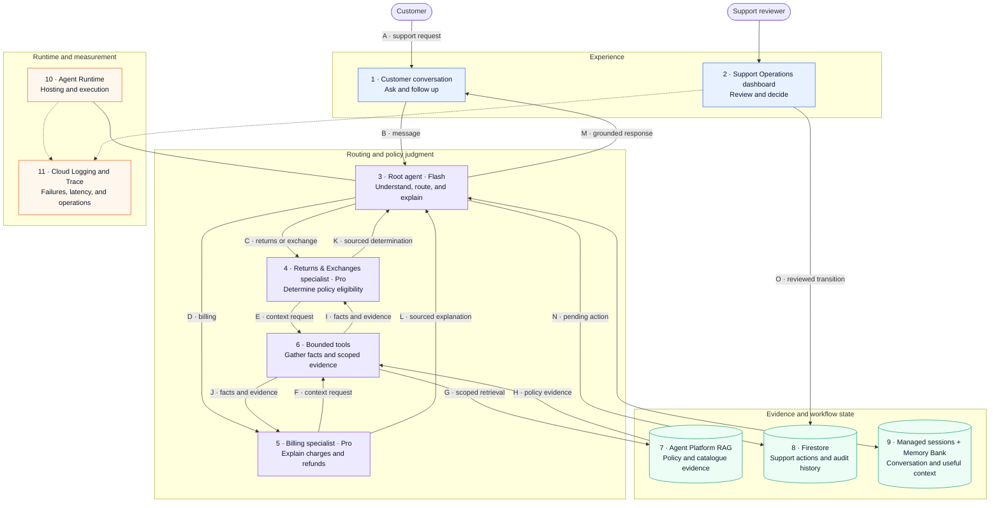

# RAG based Customer Support Operations Agentic System

**A policy-grounded support experience that gives customers clear answers while keeping consequential actions under human control.**

[Build and cost plan](BUILD_PLAN.md) · [Engineering notes](ENGINEERING_NOTES.md)

The reference scenario is Tarnfield Running Co., a fictional running retailer. The product supports returns, exchanges, and billing questions using current policy evidence, customer context, durable action requests, and a private operations workflow for human reviewers.

## 1. User

The first user is a **customer who needs a trustworthy answer or action without navigating policy documents or repeating their situation**. They want to know what applies to their order, why it applies, and what will happen next.

The second user is a **support reviewer responsible for customer-impacting decisions**. They need a prioritised queue, the relevant order context and policy evidence, a clear audit trail, and control over approval or completion.

The current product serves a fictional retailer with fixture order and billing data. The reviewer experience is configured for one named operator; the workflow and data model are designed so that additional reviewers can be introduced later with stronger identity controls.

## 2. Problem

Resolving a request such as *“The sole has split after a few weeks—can I exchange these shoes?”* usually requires a support agent to:

1. understand the customer’s intent and identify the relevant support area;
2. find the order, delivery, product, and payment facts;
3. locate the current policy and any product-specific override;
4. explain the decision without overstating what the evidence proves; and
5. create and track a request when human action is required.

General chat assistants can produce fluent answers, but they may rely on model memory, miss policy exceptions, or imply that an action was completed when it was not. Traditional help centres expose the policy but leave the customer to interpret it, while ticketing systems capture work without resolving the question conversationally.

**Job to be done:** Help me understand what applies to my order, show me the evidence, and move any required action into a real human-reviewed workflow without making me repeat the same context.

## 3. Why AI?

This problem benefits from AI because customers describe the same issue in many ways. The system must interpret intent, choose the relevant specialist, combine policy with order context, and explain the result in clear language.

AI does not control the parts that require exactness or authority. Deterministic software performs lookups, calculates dates, scopes retrieval, validates state transitions, creates idempotent action records, and enforces which decisions require a human.

| AI is used for | Deterministic software is used for |
| --- | --- |
| Understanding the customer’s request | Order, invoice, charge, and product lookup |
| Routing to the appropriate specialist | Date calculations and eligibility inputs |
| Interpreting retrieved policy in context | Document scoping and evidence retrieval boundaries |
| Explaining a qualified answer clearly | Action creation, state transitions, and audit history |
| Recalling useful conversational context | Authentication and reviewer permissions |

This split lets the model handle language and judgment without allowing it to invent policy, mutate support records outside defined tools, or approve its own work.

## 4. Product experience

The core loop is:

> **Ask → verify context → retrieve policy → explain → escalate when needed → track the outcome**

1. **Ask naturally.** The customer describes a returns, exchange, or billing issue in their own words.
2. **Resolve the context.** The system gathers the relevant order, delivery, product, invoice, and charge facts.
3. **Check current policy.** A specialist searches only the policy and catalogue sources relevant to the request.
4. **Explain the answer.** The customer receives a clear determination with the supporting policy section and any uncertainty stated explicitly.
5. **Create a real request.** If a refund, exchange, exception, or investigation needs human judgment, the assistant creates a durable Firestore record and returns its reference number.
6. **Apply human judgment.** An authorised reviewer can assign, approve, reject, request more information, or complete the request in the private Support Operations dashboard.
7. **Continue without starting over.** Managed sessions preserve the conversation, while Memory Bank can recall useful customer facts across separate conversations.

The reference journey follows a customer reporting a faulty shoe. The assistant checks the order and product rules, retrieves the relevant returns policy, explains the exchange path, creates a support request, and later reports the status stored by the human workflow.

## 5. Success criteria

The product is designed to measure customer value, decision safety, and operational usefulness together.

| Outcome | Measure | Current state |
| --- | --- | --- |
| Correct, grounded answers | Policy-answer accuracy, citation correctness, and unsupported-claim rate | Initial final-sale and faulty-item cases pass; broader coverage is required |
| Less customer effort | Repeated-information rate and successful session/memory recall | Same-session continuity and cross-session recall verified live |
| Safe automation | Consequential actions completed without human approval | Code and workflow prevent the assistant from approving or completing requests |
| Actionable handoffs | Requests created with sufficient context and evidence | End-to-end agent → Firestore → reviewer → status flow verified |
| Faster resolution | Time to grounded answer and time to human decision | Instrumented; recent consolidated policy checks took 22–29 seconds |
| Reliable operation | Completion, retrieval-failure, and storage-failure rates | Honest failure paths exist; production alerting remains incomplete |
| Controlled economics | Cost per resolved conversation and per reviewed request | Planning model exists; repeated measured distributions remain a next step |

The primary product metric should become **customer requests resolved correctly with traceable policy evidence**. Latency, escalation rate, human overturn rate, and cost per resolution are guardrails: automation is only valuable when it remains trustworthy and operationally affordable.

## 6. Architecture and data flow

The diagram follows one customer request from conversation to a grounded answer or reviewed action. Numbered blocks correspond to the table below it.



**Legend:** blue = user and reviewer experience · purple = agent judgment and bounded tools · green = evidence and durable state · orange = runtime and observability · solid arrows = product data flow · dashed arrows = telemetry.

| Block | Explanation |
| --- | --- |
| **1 · Customer conversation** | Accepts natural-language questions and returns grounded answers, references, and status updates. |
| **2 · Support Operations dashboard** | Gives an authorised reviewer the queue, context, evidence, decisions, and audit timeline. |
| **3 · Root agent** | Owns the customer interaction, selects a specialist, creates or checks action requests, and communicates the result. |
| **4 · Returns & Exchanges specialist** | Determines eligibility using order facts, the returns policy, and product-specific catalogue rules. |
| **5 · Billing specialist** | Explains invoices, payment methods, charges, refunds, and duplicate or pending transactions. |
| **6 · Bounded tools** | Consolidate required facts, scope each retrieval request, calculate exact values, and expose only defined actions. |
| **7 · Agent Platform RAG** | Searches the returns policy, product catalogue, and billing policy while preserving source sections. |
| **8 · Firestore** | Stores idempotent support requests, assignment, decisions, completion state, and the audit history. |
| **9 · Sessions and Memory Bank** | Preserve the current transcript and useful cross-session customer context; neither is policy evidence. |
| **10 · Agent Runtime** | Hosts and scales the three-agent application. |
| **11 · Logging and Trace** | Capture runtime and dashboard telemetry for diagnosis and operational measurement. |

### Agent responsibilities

The root currently uses `gemini-3.8-flash`; policy specialists use `gemini-3.1-pro-preview`.

| Role | Product responsibility | Boundary |
| --- | --- | --- |
| Root customer-service agent | Understand intent, route work, explain results, and manage request references | Cannot make a policy determination without specialist evidence or approve an action |
| Returns & Exchanges specialist | Determine eligibility from current policy, product rules, and order context | Can recommend or create a pending request, but cannot approve or complete it |
| Billing specialist | Explain charges, refunds, invoices, and billing policy | Cannot claim that money moved or a refund completed without stored evidence |

Returns and exchanges intentionally remain one specialist because they use the same policy, catalogue rules, and order context. Splitting them would add routing complexity without a clear improvement in customer outcomes.

## 7. Trust, safety, and failure handling

- **Policy before fluency:** specialists must retrieve current evidence; model memory is never accepted as policy authority.
- **Human control:** the assistant may create a pending request, but only a reviewer may approve, reject, request information, or complete it.
- **Evidence before confidence:** customer-facing determinations retain the supporting source section; unsupported certainty is a quality failure.
- **Deterministic action workflow:** Firestore transitions are validated, idempotent, transactional, and recorded in an audit history.
- **Scoped retrieval:** each specialist searches only its approved policy documents, reducing irrelevant evidence and cross-domain leakage.
- **Memory with limits:** remembered customer context may reduce repetition, but it cannot change eligibility or override current policy.
- **Honest failure:** when policy retrieval or durable storage is unavailable, the assistant says it cannot verify or complete the step.
- **Private review surface:** the dashboard rejects unauthenticated access and currently maps activity to one configured reviewer.

The main unresolved product risks are narrow behavioural coverage, 22–29 second response times for recent policy checks, fixture rather than live commerce data, and incomplete alerting and retention policy. These are release constraints, not details to hide behind a fluent interface.

## 8. Evaluation and observability

Evaluation is organised around the customer outcomes the product must protect: correct routing, grounded policy interpretation, clear delivery, useful memory, safe action creation, and accurate status reporting.

The deterministic suite checks architecture, tool boundaries, state transitions, concurrency, API contracts, and serving behaviour. Live smoke journeys exercise model calls, RAG, memory, and the full human-action workflow. Cloud Logging and Trace provide runtime evidence; the dashboard exposes queue size, overdue work, and decision time.

Latest validation on **13 September 2026**:

- automated suite: **50 tests passed**, with one credit-spending integration test intentionally opt-in;
- initial behavioural eval: **2/2 cases graded 5/5** for final-sale refusal and faulty-item exchange handoff;
- same-session follow-up correctly recalled the product edition without another lookup;
- cross-session Memory Bank recall returned the stored email address and first-marathon goal after an observed **8.2-second indexing delay**;
- a duplicate-charge question was explained as an authorisation hold with billing-policy evidence;
- the deployed action journey created, assigned, approved, completed, and re-read a real exchange request.

This evidence proves the workflow and its core safety boundaries, not broad production quality. The next evaluation set must add ambiguous requests, conflicting evidence, retrieval outages, duplicate actions, unsafe approval attempts, long conversations, and human overturns.

## 9. Product decisions and tradeoffs

| Decision | Why | Tradeoff |
| --- | --- | --- |
| Three bounded agent roles | Separates customer communication from specialist policy judgment | Adds model calls, latency, and orchestration complexity |
| Returns and exchanges share one specialist | They depend on the same evidence and order context | A larger policy domain can make prompts and eval coverage broader |
| Pro specialists and a Flash root | Spend more reasoning capacity on policy interpretation and keep routing/delivery lighter | Mixed-model behaviour is harder to compare and operate |
| Managed sessions plus Memory Bank | Preserve immediate context and reduce repetition across conversations | Memory is eventually consistent and adds privacy and retention obligations |
| Firestore for action state | Supports durable, transactional requests and an auditable workflow | Does not execute work in an external commerce system |
| One named reviewer first | Keeps the human-control boundary real and testable | Does not yet support independent attribution across a support team |
| Scale-to-zero services | Keeps low-volume operating cost small | Cold starts can increase customer and reviewer latency |
| Evidence tools consolidate lookups | Reduces tool chatter and repeated model turns | Larger tool responses can increase token use and hide which input drove a conclusion |

At the documented baseline of 1,000 two-turn conversations per month, the planning estimate is **$50–$100 per month**, or roughly **$0.05–$0.10 per conversation**. This is a planning model rather than a billing quote. Model use is the largest cost lever, so the planned all-Flash experiment must compare quality, latency, and cost per resolved conversation rather than optimising token price alone.

## 10. What comes next

The next product milestones are ordered by user value and learning:

1. **Strengthen quality evidence:** expand behavioural cases across routing, retrieval, explanation, memory, and action safety, including human-reviewed holdouts.
2. **Reduce response time:** measure repeated latency distributions, identify retrieval and model bottlenecks, and test whether an all-Flash configuration preserves answer quality.
3. **Close the reviewer feedback loop:** measure approval, rejection, requested-information, completion, and human-overturn patterns to find weak automation boundaries.
4. **Improve operational readiness:** define alerts, retention rules, policy-ingestion ownership, and recovery procedures for retrieval or storage failures.
5. **Add reviewer identity when needed:** introduce IAP or an equivalent identity-aware layer before expanding beyond one operator.
6. **Connect real systems deliberately:** replace order and billing fixtures only after the approval, rollback, idempotency, and audit contracts are proven against a commerce API.

## 11. Run and validate locally

<details>
<summary><strong>Local setup</strong></summary>

Prerequisites: Python 3.11–3.13, `uv`, `agents-cli`, `gcloud` with Application Default Credentials, and access to the configured Google Cloud project and RAG corpus.

```bash
uv tool install google-agents-cli~=1.5.0
gcloud auth application-default login
uv sync
cp .env.example .env
touch .env.local
```

Keep non-secret configuration in `.env`:

```dotenv
GOOGLE_GENAI_USE_VERTEXAI=false
GOOGLE_CLOUD_PROJECT=<your project>
GOOGLE_CLOUD_LOCATION=global
RAG_CORPUS_LOCATION=us-central1
```

Put the local Gemini developer key only in `.env.local`:

```dotenv
GEMINI_API_KEY=<your local key>
```

`agents-cli deploy` reads `.env` and turns its entries into Agent Runtime environment variables. Keeping the developer key in `.env.local` prevents it from bypassing Secret Manager during deployment. Never commit either active file.

Start the local experience:

```bash
make rag-status
make rag-up
make playground
```

The playground is available at `/dev-ui/?app=app`.

</details>

<details>
<summary><strong>Validation commands</strong></summary>

```bash
make test
make eval
```

The following commands call live services and may spend credits:

```bash
make smoke
make memory-smoke
make deployed-action-smoke
```

The RAG corpus must exist before grounded policy checks or behavioural evaluation can succeed.

</details>

<details>
<summary><strong>Private reviewer dashboard</strong></summary>

Start an authenticated local proxy with the Google account that has reviewer access:

```bash
gcloud run services proxy support-ops-dashboard \
  --project=<your-project-id> \
  --region=us-central1 \
  --port=8090
```

Open `http://127.0.0.1:8090/ops/`. Anonymous calls to the Cloud Run service are rejected.

</details>

<details>
<summary><strong>Agent Runtime deployment</strong></summary>

```bash
unset GOOGLE_APPLICATION_CREDENTIALS
gcloud config set project <your-project-id>
agents-cli deploy
```

Production secrets belong in Secret Manager. [BUILD_PLAN.md](BUILD_PLAN.md) records product decisions and acceptance criteria; [ENGINEERING_NOTES.md](ENGINEERING_NOTES.md) contains platform-specific implementation details.

</details>

## Current product boundaries

- Order, invoice, product, and billing records are fixtures rather than a live commerce integration.
- The behavioural dataset contains only two initial product cases and cannot support a broad quality claim.
- Recent consolidated policy journeys took 22–29 seconds, above the proposed 15-second target.
- Memory Bank is eventually consistent; the observed indexing delay was 8.2 seconds in the latest live check.
- The private dashboard supports one configured reviewer identity; team-level attribution requires IAP or an equivalent control.
- The dashboard polls every 15 seconds and is not designed as a high-volume real-time operations centre.
- Firestore and related IAM resources were initially provisioned manually; the Terraform declarations must be imported into state before a full apply.
- No commerce API executes an approved refund, exchange, or billing correction. Completion is explicitly recorded by a human reviewer.
- Cost estimates are planning assumptions until repeated production-like traffic provides measured distributions.

Detailed outcomes, cost assumptions, and acceptance criteria are maintained in [BUILD_PLAN.md](BUILD_PLAN.md).
