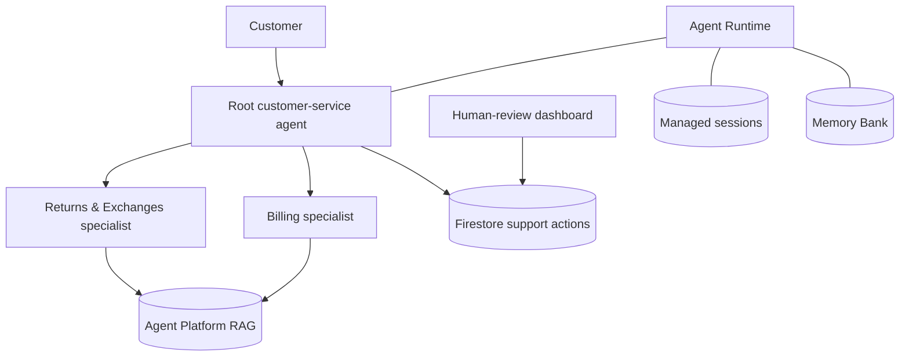

# RAG based Customer Support Operations Agentic System

**Reference scenario:** Tarnfield Running Co., a fictional running retailer.

A policy-grounded customer-support assistant designed around useful automation, visible evidence, customer continuity and human control over consequential actions.

The assistant helps with **returns, exchanges and billing**. It searches Tarnfield’s policy documents through Google Cloud Agent Platform RAG, remembers useful details from previous conversations, and files durable support requests for human review.

> **Current status:** The three-agent RAG assistant is deployed to Agent Runtime in `us-central1`. Firestore support actions and the private Support Operations dashboard are implemented. Live tests confirm grounded specialist answers, managed-session continuity and cross-session Memory Bank recall; the final release check covers the complete agent → Firestore → reviewer → status workflow. The next product priority is broader behavioural evaluation and latency experimentation. See [BUILD_PLAN.md](BUILD_PLAN.md) for evidence and trade-offs.

---

## The product in one minute

### Customer experience

A customer asks a natural-language question such as:

> “I bought these shoes a few weeks ago and the sole has split. Can I exchange them?”

The root agent sends the policy work to the Returns & Exchanges specialist. That specialist checks the order, searches the current returns policy and product catalogue, and returns a sourced determination. The root explains it clearly to the customer.

If an action or exception needs human review, the workflow creates a Firestore request and returns a real reference number. An authorised employee reviews it in the Support Operations dashboard. The assistant never approves or completes customer-impacting work itself.

### Support-team experience

The dashboard provides:

- A live queue of pending Returns, Exchanges and Billing requests
- Order context, customer request and cited policy evidence
- Assign, approve, reject, request-information and complete actions
- A complete audit timeline
- Essential metrics such as queue size, overdue work and decision time

---

## Architecture



### The three agents

| Agent | Role |
|---|---|
| Root | Speaks to the customer, chooses the specialist and communicates the answer |
| Returns & Exchanges | Determines eligibility using the returns policy, product catalogue and order context |
| Billing | Explains charges, refunds, payment methods, invoices and billing issues |

Returns and Exchanges intentionally remain one specialist because they share the same policy, catalogue rules and order context. Splitting them would add routing complexity without clear user value.

### RAG and memory

| Capability | What it does |
|---|---|
| Agent Runtime | Hosts the deployed assistant |
| Agent Platform RAG Engine | Searches the returns policy, product catalogue and billing policy |
| Managed sessions | Stores the complete history of each conversation |
| Memory Bank | Recalls useful customer facts across separate conversations |

Managed sessions are the transcript; Memory Bank is the useful set of notes. Memory can personalise the experience, but it can never decide policy. Specialists must always retrieve current policy evidence.

---

## Human review and dashboard

The target product follows a strict rule:

> The assistant may create a request. Only a human may approve, reject or complete it.

The assistant can create a pending support action in Firestore and check an existing action’s status. The reviewer dashboard uses an authenticated backend to make human decisions. Approval authorises work; completion confirms it happened. Every status change records the reviewer, timestamp and note.

The deployed MVP is a private Cloud Run service protected by Google Cloud IAM and configured for one named reviewer. That is a clean single-reviewer boundary, but it is not the final multi-user identity design. Production expansion should put Identity-Aware Proxy in front of the service so every reviewer is identified independently and role membership can be managed centrally.

Firestore is the operational source of truth. BigQuery is not required for the MVP and will be introduced only if historical analytics eventually outgrow simple Firestore queries.

---

## What is built today

- Root, Returns & Exchanges, and Billing agents
- Specialist-to-root control flow
- One serverless RAG corpus containing three policy PDFs
- Code-enforced document scoping per specialist
- Consolidated context tools that gather required records and policy evidence together
- Honest failure when policy retrieval is unavailable
- Order, invoice and charge fixtures for realistic demonstrations
- Managed-session and Memory Bank paths for Agent Runtime
- Deployment to Agent Runtime
- Firestore action records with idempotent creation, transactional state changes and audit history
- Private reviewer dashboard with queue, evidence, assignment, decisions and operational metrics
- Structural, workflow, API and serving-contract tests

### Latest live deployment proof — 13 September 2026

- A final-sale return was correctly refused using the product-catalogue override and retained the source section in the customer reply.
- A follow-up in the same managed session correctly recalled the product edition without another lookup.
- A duplicate-charge question was correctly explained as an authorisation hold and cited the billing policy.
- A new conversation for the same test customer recalled both an email address and a first-marathon goal from Memory Bank.
- Memory Bank took 8.2 seconds to index the first conversation. This is expected eventual consistency, but it is a real UX constraint to measure and design around.
- The automated suite passes with 50 tests; one credit-spending integration test remains deliberately opt-in.
- Two initial product-specific eval cases graded 5/5: final-sale refusal and a faulty-item exchange handoff.
- A deployed workflow test created a real exchange request, moved it through human assignment, approval and completion, then confirmed the agent reported the stored final status. Synthetic records were removed afterwards.
- Synthetic live-test sessions and memories were removed after verification so they do not distort future dashboard analytics.

## What is being improved next

1. Expand the behavioural dataset across routing, retrieval, delivery, memory and action safety
2. Measure repeated latency, quality, token and cost distributions
3. Compare the current model mix with an all-Flash variant
4. Add IAP-based multi-reviewer identity if the demo expands beyond one operator
5. Define retention, alerting and policy-ingestion ownership

Detailed outcomes and acceptance criteria are in [BUILD_PLAN.md](BUILD_PLAN.md).

---

## Google Cloud services and estimated MVP cost

The estimate below is a **planning model, not a billing quote**. Prices are in
USD, checked on 13 September 2026, and exclude tax, currency conversion, free
trial credits and any other workloads sharing the same billing account.

Because this deployment sets `GOOGLE_GENAI_USE_VERTEXAI=false`, model calls use
the Gemini Developer API rather than Vertex AI model endpoints. It is included
below because it is part of the product and is likely to be the largest cost,
but it may appear separately from the Google Cloud infrastructure charges.

### Cost scenario

To make the estimate concrete, the baseline assumes:

- 1,000 customer conversations per month
- Two customer turns per conversation, or 2,000 turns in total
- One specialist call and one root-agent call per customer turn
- Roughly 4,000 input and 800 output tokens for the Pro specialist, plus 2,000
  input and 300 output tokens for the Flash root, per turn
- Around 10 stored managed-session events per turn and light Memory Bank use
- Three small policy PDFs, a low-volume reviewer dashboard and no minimum warm
  instances

| Google service | Role in this MVP | Main billing driver | Approx. monthly cost at the baseline |
|---|---|---|---:|
| **Gemini Developer API** | Runs `gemini-3.1-pro-preview` for specialist judgement and `gemini-3.8-flash` for root routing and customer delivery. The API key is supplied through Secret Manager. | Input, output and thinking tokens. Current paid rates are $2/$12 per million Pro input/output tokens and, through 31 December 2026, $0.75/$3.75 per million Flash input/output tokens. | **$40–$80** |
| **Agent Platform Agent Runtime** | Hosts and scales the three-agent application. The deployed runtime uses 1 vCPU, 4 GiB memory, zero minimum instances and up to 10 maximum instances. | Active vCPU-hours at $0.0864 and memory at $0.009 per GiB-hour. One active runtime hour is therefore about $0.1224. | **$2–$5** |
| **Agent Runtime managed sessions** | Stores complete conversation events so a customer can continue the same conversation. | $0.25 per 1,000 stored session events. | **About $5** |
| **Agent Runtime Memory Bank** | Stores and retrieves useful facts across separate conversations. | $0.25 per 1,000 memories stored per month, $0.50 per 1,000 retrieved, plus the model calls used to generate memories. | **$2–$5** |
| **Agent Platform RAG Engine — Serverless** | Manages the policy corpus and retrieval workflow. Serverless mode has no additional RAG orchestration charge; model, reranking and vector-storage usage can still be billed. | Corpus ingestion, embeddings and managed vector retrieval. With only three small PDFs, usage should be tiny. | **$0–$1** |
| **Firestore** | Stores durable human-action requests, status, evidence and audit history. | Document reads, writes, deletes and storage. The default database includes 50,000 reads, 20,000 writes, 20,000 deletes per day and 1 GiB storage at no charge. | **$0** |
| **Cloud Run** | Hosts the private Support Operations dashboard with 1 vCPU, 1 GiB memory and zero minimum instances. | Requests and active compute. Scale-to-zero and the Cloud Run free allowance should cover this MVP traffic. | **$0** |
| **Secret Manager** | Holds the deployed Gemini API key. | Active versions and access operations. The first six active versions and 10,000 accesses per month are free. | **$0** |
| **Cloud Build** | Builds the dashboard container during deployment. | Build minutes. The default pool currently includes 2,500 free build-minutes per billing account each month. | **$0** |
| **Artifact Registry** | Stores dashboard container images. | Stored image size. The first 0.5 GiB per billing account is free; storage above that is roughly $0.10/GiB-month. | **$0–$1** |
| **Cloud Storage** | Temporarily stages deployment source and artifacts. | Stored data and transfer. The MVP footprint is very small. | **About $0** |
| **Cloud Logging and Trace** | Captures runtime, dashboard and deployment telemetry for debugging and operations. | Ingested telemetry volume and retention. The first 50 GiB of Cloud Logging data per project each month is free. | **$0** |
| **IAM, Service Usage and Cloud Resource Manager** | Provide identities, permissions, API activation and project-level resource control. | No separate charge for the MVP usage shown here. | **$0** |

### Approximate total

> **Planning estimate: approximately $50–$100 per month for 1,000 two-turn
> customer conversations, or roughly $0.05–$0.10 per conversation.**

At the current low-volume traffic level—tens rather than thousands of
conversations—the practical monthly cost should be roughly **$1–$10**, and may
be lower while free tiers or credits apply. This should not be presented as a
guaranteed bill: model reasoning tokens, retry rates, conversation length,
memory extraction, log volume and cold-start duration can all move the result.

The biggest cost lever is model usage, not Firestore or the dashboard. The
planned all-Flash experiment should therefore compare **answer quality,
latency and cost per resolved conversation**, rather than treating cheaper
tokens as an automatic product win.

Official pricing references: [Gemini Developer API](https://ai.google.dev/gemini-api/docs/pricing),
[Agent Runtime, sessions and Memory Bank](https://cloud.google.com/blog/products/ai-machine-learning/new-enhanced-tool-governance-in-vertex-ai-agent-builder),
[RAG Engine Serverless mode](https://docs.cloud.google.com/gemini-enterprise-agent-platform/build/rag-engine/serverless-mode),
[Firestore](https://cloud.google.com/firestore/pricing),
[Cloud Run](https://cloud.google.com/run/pricing),
[Secret Manager](https://cloud.google.com/secret-manager/pricing),
[Cloud Build](https://cloud.google.com/build/pricing),
[Artifact Registry](https://cloud.google.com/artifact-registry/pricing) and
[Cloud Logging](https://cloud.google.com/logging).

For ongoing cost control, configure a Google Cloud budget alert and review the
actual cost per successful workflow after each eval or traffic test. Free-tier
allowances are shared at the billing-account or project level, so another
workload can consume them first.

---

## Product principles

- **Policy over model memory.** A fluent unsupported answer is a failure.
- **Human control over consequential actions.** The assistant cannot approve itself.
- **Deterministic software for deterministic work.** Code calculates dates, validates transitions and persists actions.
- **Evidence before confidence.** Policy determinations retain their sources.
- **Honest failure.** Retrieval or storage problems are communicated plainly.
- **Measure before optimising.** Changes are compared against a stable baseline.
- **Customer memory with limits.** Memory reduces repetition but never becomes policy evidence.
- **Operational usefulness.** Human decisions, queue health, latency and cost must be observable.

---

## Local setup

### Requirements

- Python 3.11–3.13
- `uv`
- `agents-cli`
- Google Cloud CLI with Application Default Credentials
- Access to the configured Google Cloud project and RAG corpus

```bash
uv tool install google-agents-cli~=1.5.0
gcloud auth application-default login
uv sync
cp .env.example .env
touch .env.local
```

### Why `.env` and `.env.local` are separate

This is an important deployment safety boundary, not a Python requirement:

| File | Purpose | May contain the Gemini key? | Used by `agents-cli deploy`? |
|---|---|---:|---:|
| `.env.example` | Safe template committed to GitHub | No | No |
| `.env` | Active non-secret configuration | **No** | **Yes** |
| `.env.local` | Active secrets for this computer only | **Yes** | No |

The application could run with the key in `.env`, but `agents-cli deploy` reads
that file and converts its entries into Agent Runtime environment variables.
Keeping the key in `.env.local` prevents a local secret from bypassing Secret
Manager during deployment. In production, the key comes from Secret Manager.

Keep non-secret configuration in `.env`:

```dotenv
GOOGLE_GENAI_USE_VERTEXAI=false
GOOGLE_CLOUD_PROJECT=<your project>
GOOGLE_CLOUD_LOCATION=global
RAG_CORPUS_LOCATION=us-central1
```

Put the developer key only in `.env.local`:

```dotenv
GEMINI_API_KEY=<your local key>
```

The Gemini key authenticates model calls. Agent Platform RAG still uses Google Cloud Application Default Credentials.

**Never commit either active local file or place the key in `.env`.** Both active
files are ignored by Git, but the deployment workflow still consumes `.env`.
`.env.local` is deliberately local-only.

### Before pushing to GitHub

- Confirm `GEMINI_API_KEY` exists only in `.env.local` and Secret Manager.
- Confirm `.env` and `.env.local` are ignored by Git.
- Commit `.env.example` only; it must contain placeholders, never real values.
- Review `git diff --staged` before pushing to ensure no secret was staged elsewhere.

### Corpus and playground

```bash
make rag-status       # confirm corpus contents and serverless mode
make rag-serverless   # one-time project setting
make rag-up           # create and ingest the corpus when absent
make playground       # local UI at /dev-ui/?app=app
```

The corpus must exist before grounded policy answers or behavioural evaluation can work.

### Tests and live checks

```bash
make test              # structural and integration tests
make smoke             # live model + RAG conversations; spends credits
make memory-smoke      # two live conversations proving recall; spends credits
make deployed-action-smoke # full deployed action workflow; spends credits
make eval              # product-specific behavioural evaluation
```

The deterministic suite covers wiring, state transitions, concurrency and API boundaries. Smoke runners exercise live model, RAG, memory and human-action behaviour. The behavioural dataset begins with final-sale refusal and faulty-item handoff cases and will expand across routing, retrieval, delivery, memory and action safety.

### Open the private operations dashboard

The dashboard is deployed at `support-ops-dashboard` in `us-central1`. Because it
is private, start an authenticated local proxy with the same Google account that
has reviewer access:

```bash
gcloud run services proxy support-ops-dashboard \
  --project=<your-project-id> \
  --region=us-central1 \
  --port=8090
```

Then open `http://127.0.0.1:8090/ops/`. Anonymous calls to the Cloud Run URL are
rejected with HTTP 403. For one-click browser access and multiple independently
identified reviewers, the planned upgrade is IAP.

---

## Deployment and secrets

The application targets Google Cloud Agent Runtime. Production secrets must be stored in Secret Manager rather than committed or placed in documentation.

```bash
unset GOOGLE_APPLICATION_CREDENTIALS
gcloud config set project <your-project-id>
agents-cli deploy
```

Platform-specific implementation lessons live in [ENGINEERING_NOTES.md](ENGINEERING_NOTES.md). Product decisions and trade-offs live in [BUILD_PLAN.md](BUILD_PLAN.md).

---

## Repository guide

```text
customer-chatbot-rag/
├── BUILD_PLAN.md           # Product strategy, architecture and delivery plan
├── ENGINEERING_NOTES.md    # Implementation details and platform lessons
├── app/
│   ├── agents.py           # Root and specialist construction
│   ├── prompts.py          # Responsibilities and behavioural boundaries
│   ├── tools.py            # Policy, lookup and current request tools
│   ├── retrieval.py        # Scoped Agent Platform RAG search
│   ├── support_actions.py  # Firestore records and workflow rules
│   ├── dashboard_api.py    # Authenticated reviewer API
│   ├── dashboard_app.py    # Dashboard-only Cloud Run entry point
│   ├── static/             # Operations dashboard UI
│   ├── callbacks.py        # Memory write path
│   └── data/fixtures.json  # Demonstration order and billing data
├── docs/                   # Tarnfield policy PDFs
├── scripts/                # Corpus lifecycle and live smoke runner
├── tests/                  # Structural, integration and evaluation tests
└── deployment/terraform/   # Google Cloud infrastructure
```

---

## Known limitations

- Order, invoice and billing data are fixtures, not a live commerce integration.
- The initial behavioural suite has only two product cases; it is evidence of wiring, not broad quality coverage.
- Recent consolidated policy checks took 22–29 seconds; this remains above the proposed 15-second target.
- The private dashboard uses one configured reviewer identity; multi-user production attribution requires IAP or an equivalent identity-aware proxy.
- The dashboard polls every 15 seconds. This is sufficient for the MVP queue, but not a high-volume real-time operations centre.
- Firestore and related IAM were first provisioned manually; adopting the Terraform declaration requires importing those resources into state before any full apply.
- No commerce API executes approved work yet; completion is explicitly recorded by a reviewer.

These limitations are visible by design. The goal is to show sound product judgement, measurable iteration and responsible automation—not to present a prototype as a finished support platform.
