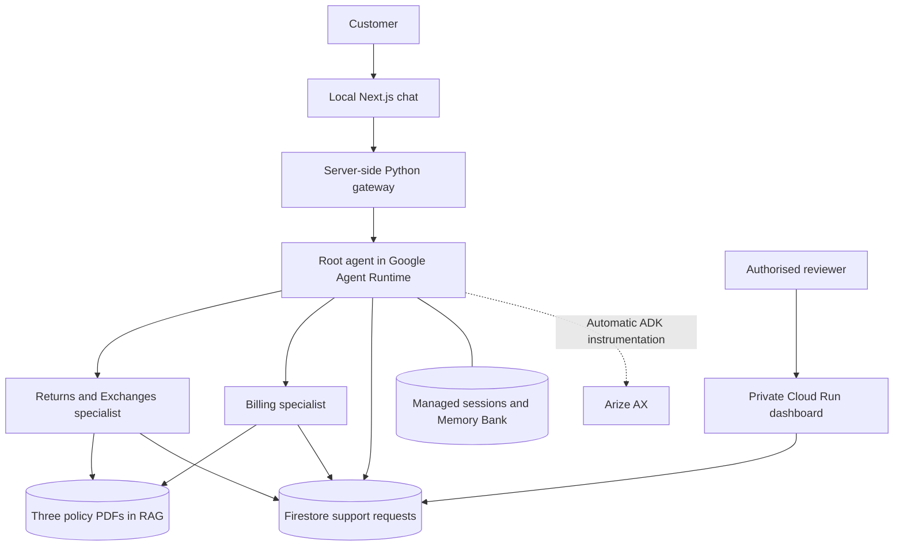

# Tarnfield Care — policy-grounded customer support

**Portfolio scenario:** Tarnfield Running Co., a fictional running retailer. The app helps customers understand returns, exchanges and billing, then creates durable requests for a human to review when action is needed.

**[Open Tarnfield Care — the customer chat app](http://127.0.0.1:3010)**

This is the product's current entry point. The frontend runs locally on this
computer and connects to the deployed Google Cloud agent. Start the UI and
gateway using [Run and verify](#run-and-verify) if they are not already running.
A public product URL has not been deployed yet.

## 1. User

| User | Job to be done | Current friction |
|---|---|---|
| Customer | Understand eligibility or a charge, and get a clear next step | Rules span several documents; exceptions and order details are hard to interpret |
| Support reviewer | Make an accountable decision with the relevant evidence | Repeated policy checks, incomplete handoffs and unclear request status |

The demonstration uses synthetic orders, products, invoices and charges. It does not connect to a live commerce or payment platform.

## 2. Problem

Customers need an answer that applies the correct policy to their situation. A final-sale rule can override the normal return window; a faulty item may require a different path; a pending authorisation can look like a duplicate charge. A generic fluent answer can invent eligibility, promise a refund or lose the handoff.

The product combines retrieved policy evidence, order context and a persistent review workflow. The intended value is less customer effort and less reviewer lookup time, while preserving human control over consequential actions. Time saved, resolution rate and satisfaction still need a measured pilot.

## 3. Why AI?

An LLM interprets varied customer language, connects the question to policy clauses and explains the result in context. Retrieval gives the model current evidence. These are useful language tasks.

Deterministic code calculates dates, scopes retrieval, validates request schemas, persists records and controls status transitions. The assistant may file a pending request; it cannot approve, reject or complete one. A human decision remains necessary before customer-impacting work proceeds.

## 4. Success criteria

These are proposed product gates and dated evidence, not claims that the app meets every launch requirement.

| Outcome | Proposed measure | Evidence and limit |
|---|---|---|
| Grounded policy decisions | Correct eligibility, supported citations and no invented policy across a held-out suite | Two development cases scored 5/5 on 13 September; broader coverage and release gates remain open |
| Safe handoffs | No autonomous approval/completion; durable, idempotent pending requests | Workflow tests and a deployed synthetic agent → Firestore → reviewer → status check passed |
| Responsive chat | Completed-turn p95 ≤15 seconds; track time to first useful text separately | Latest traced turn took 35.14s; another workflow took 143.3s and exceeded the 120s gateway limit. No representative p95 baseline |
| Conversation continuity | Reliable same-session history and appropriate cross-session recall | Both paths verified; a historical memory write took 8.2s to become searchable |
| Observable operations | Automatically capture agent/model/tool structure, usage and failures without leaking content | Latest normal frontend turn visible in Arize AX with ten automatic spans and masked payloads |
| Efficient resolution | Cost per grounded completion, reviewer time, retries, drop-off and customer satisfaction | Collection and a representative pilot remain to be established |

The [build plan](BUILD_PLAN.md) expands the acceptance criteria and remaining risks.

## 5. UX and interaction design

The light customer interface provides a responsive chat, saved conversations, new-conversation and search controls, reply copying and policy links. The customer asks questions, manages conversations and decides whether to pursue a handoff. The assistant retrieves evidence and explains its determination. See the [frontend guide](frontend/README.md) for controls, accessibility, storage and failure behaviour.

Policy references help users inspect the basis for an answer. A filed request is **pending review**, not a completed refund or exchange. The separate reviewer dashboard shows request evidence, order facts, assignment, decision notes and audit history. Approval authorises work; completion records that the reviewer reports it happened. No integration executes a payment or fulfilment action.

Stop ends the visible stream; it does not guarantee cancellation of work already dispatched to the cloud. After a timeout or interrupted action, reload the conversation and check request status before retrying. The gateway retains its in-flight guard until completion or timeout to reduce duplicate dispatch.

## 6. Agent and system design



| Layer | Current choice and purpose |
|---|---|
| Customer UI | Next.js, React, TypeScript, Tailwind and Radix primitives for a responsive, accessible chat |
| Gateway | FastAPI and Google's platform SDK; keeps credentials server-side and bridges managed sessions to streamed replies |
| Orchestration | Google ADK with explicit specialist `AgentTool` calls; the root retains the customer-facing voice |
| Models | Root: `gemini-3.8-flash`; specialists: `gemini-3.1-pro-preview`; evaluation judge: `gemini-3.7-flash` |
| Retrieval | One serverless corpus containing returns, catalogue and billing PDFs; code enforces specialist document scope |
| State | Managed sessions and Memory Bank in Agent Runtime; Firestore for deployed support actions; SQLite/in-memory paths for local development |
| Quality evaluation | `agents-cli` generation and a custom Gemini judge with saved local reports |
| Observability | Automatic OpenInference ADK instrumentation exported to Arize AX; Cloud telemetry for infrastructure diagnosis |
| Hosting | Deployed Agent Runtime and private Cloud Run reviewer dashboard; local customer UI and gateway |

Returns and Exchanges share one specialist because they use the same rules and order context. Consolidated context tools gather records and scoped policy evidence together. Memory supports continuity but never overrides current policy. Missing retrieval or persistence must produce an honest failure.

The latest measured turn made **four model calls**; the number of agents is not the number of calls. An all-Flash experiment is planned only after establishing repeated quality, latency and cost measurements. [Engineering decisions and failure analysis](ENGINEERING_NOTES.md).

## 7. Evaluation and experimentation

Quality grading runs through **`agents-cli` and the project's custom Gemini judge**. Migrating observability from Galileo to Arize AI did not replace that engine. Hosted Arize evaluators, experiments, score uploads and automatic case-to-trace correlation are not configured.

The initial dataset contains two development cases: final-sale refusal and a faulty-item exchange handoff. The successful 13 September grading report gave both 5/5, but its `pass_rate` is null. An earlier attempt failed judge authentication; grading the same captured responses after fixing credentials is not evidence of improved agent behaviour. Artifacts are local and ignored by Git.

The latest runtime verification passed **147 Python checks with one opt-in live check skipped**, including **58 focused tracing checks**; Ruff passed. Earlier frontend acceptance passed **30 tests**, TypeScript checks, a production build and dependency audit. These checks cover software behaviour; they do not establish model accuracy across the product.

The [evaluation runbook](docs/evaluation.md) covers reproducible commands, backend isolation, saved reports, privacy, coverage and proposed release gates. Expand coverage to retrieval failure, conflicting policy, prompt injection, action retries, memory isolation, billing, unsupported intents and latency/cost distributions; retain held-out cases and inspect critical failures individually.

**Execution caution:** bare `make eval` uses the configured backend and can create support requests. It does not isolate Firestore. The runbook also explains how an already registered ADK server can defeat new environment overrides. Use a controlled server and synthetic data for a baseline.

## 8. Observability: Arize AI

The current destination is **Arize AX**, Arize AI's hosted product. Normal ADK execution automatically generates agent, model, tool and chain spans. The integration attaches an exporter to the existing OpenTelemetry provider; application code does not manually construct traces. It exports only the OpenInference ADK scope, avoiding duplicate native Google model usage.

On **1 October 2026**, a normal frontend chat through the deployed agent produced trace `ee18fb93d34d639e485828b08573974e` in managed session `3156356794222116864`: status OK, **35.14 seconds**, **11,424 tokens**, and **ten spans** comprising two chains, two agents, four model calls and two tools. The sourced final-sale answer filed no request. This verifies delivery and one successful turn, not general quality or a latency SLA.

The Arize key is injected from Secret Manager in the cloud and kept in ignored `.env.local` locally. Content capture is off by default. Arize export masks model/tool payloads and sanitizes content-bearing error details while retaining operational metadata. Native Google telemetry has its own capture configuration and needs its own privacy review.

The [observability guide](docs/observability.md) covers setup, transport proof, deployed evidence and troubleshooting. Alert thresholds, a complete retention/consent policy and hosted Arize quality jobs remain open.

## 9. Product iteration and feedback

| Evidence | Decision | Result or next measurement |
|---|---|---|
| Weak contrast, vacant space and broken conversation controls | Refine typography/layout and conversation state handling | Frontend acceptance checks passed; usability and task completion still need a pilot |
| A 143.3s workflow included a 124.7s initial root-model call | Diagnose model and retry time separately from UI time | Automatic traces expose the bottleneck; compare matched model variants under a budget |
| Native Google model spans duplicated exported usage and exposed content | Restrict Arize export scope and sanitize exported copies | Corrected deployed trace contains ten spans with masked payloads and no duplicate native usage |
| Consequential actions need accountable review | Persist pending requests, human decisions and audit events | End-to-end synthetic workflow verified; multi-reviewer identity remains a launch requirement |

The next feedback loop should connect failed turns, retries, abandonment, reviewer overrides, resolution time and satisfaction to specific changes. A full product analytics funnel is not implemented yet.

## 10. AI safety and trust

Implemented controls include scoped retrieval, validated tool inputs, bounded requests, durable idempotent action creation, transactional state changes and a human-only decision boundary. The customer sees sourced explanations and request status rather than a promise that the model completed a refund.

The frontend's signed anonymous identity is suitable for this demonstration; it is not verified customer authentication or proof of order ownership. The deployed dashboard admits Cloud Run IAM invokers and maps them to one configured reviewer. Independently attributable multiple reviewers require IAP or equivalent trusted identity and a defined role model.

Before a customer launch, validate prompt-injection and abuse cases, citation correctness, cross-user isolation, policy freshness, content retention and consent, access revocation and rate/quota limits. Keep secrets out of browsers, datasets and shared reports. Local evaluation reports contain full content even when Arize export is masked.

## 11. Production, operations and cost

The Google project is `gemini-enterprise-learning`; the agent is in `us-central1`:

```text
projects/823305428259/locations/us-central1/reasoningEngines/3469440221970432000
```

Agent Runtime retains **zero minimum and ten maximum instances**. Scale-to-zero readiness does not mean an instance is always warm.

For internal support operations, the latest [private Cloud Run reviewer service](https://support-ops-dashboard-tdghggm6ma-uc.a.run.app/ops/) is `support-ops-dashboard`, ready revision `support-ops-dashboard-00004-nt7` as checked on 1 October 2026. Staff access requires authentication; direct browser access returns Forbidden. The [operations access and recovery guide](docs/deployment.md#open-the-private-cloud-run-dashboard) contains the reviewer proxy instructions. Customers use the chat app linked at the top of this README.

See [deployment and recovery](docs/deployment.md) for secret bindings, service ownership and release checks. Existing manually provisioned resources need reconciliation/import before Terraform can manage them safely.

The latest trace's model-cost estimate was **$0.019899 for one turn**. It excludes infrastructure, memory generation, evaluation and Arize plan charges; it is not a bill or a representative cost per conversation. The [cost guide](docs/costs.md) explains the measured sample, explicit planning assumptions, current model rates and service cost drivers.

The remaining launch work includes public customer hosting, verified identities and ownership checks, broader quality gates, a measured latency baseline, operational alerts, retention ownership, CI/CD and a rehearsed rollback. This is a working portfolio MVP with documented evidence and limits.

## 12. Portfolio evidence

The product demonstrates policy-grounded delegation, deterministic action safety, durable human review, conversation continuity and automatic observability. September checks verified same-session recall, cross-session Memory Bank recall, billing explanation and a complete synthetic review workflow. October checks verified the customer frontend and deployed Arize delivery.

The evidence supports those specific behaviours. It does not yet establish broad answer accuracy, real commerce execution, an uptime SLA, customer satisfaction or an acceptable p95. The documentation records the tradeoffs and next experiments needed to establish them.

## Run and verify

Use Python 3.11–3.13, `uv`, Node/npm, Google Cloud CLI and an authorised Google project. Install the existing CLI line and locked dependencies:

```bash
uv tool install 'google-agents-cli~=1.5.0'
uv sync --locked --extra eval --extra lint
cp -n .env.example .env
cp -n .env.local.example .env.local
chmod 600 .env.local
gcloud auth application-default login
```

Fill non-secret project/corpus settings in `.env` and local keys in `.env.local`; preserve existing files when resuming this project. Do not put actual keys in templates or deployment-facing `.env`. For live frontend chat, configure the current runtime via ignored `deployment_metadata.json` or `DEPLOYED_AGENT_RUNTIME_ID` as described in the [frontend guide](frontend/README.md).

Run each server in its own terminal:

```bash
npm --prefix frontend ci
make chat-gateway
make chat-ui
```

Open **[Tarnfield Care](http://127.0.0.1:3010)**. `make playground` provides the alternative ADK development interface on port 8080 with local SQLite sessions. Run `make rag-status` to inspect corpus readiness before live questions. If the corpus is missing, review `make rag-up` before ingestion; RAG mode changes are project-wide infrastructure operations.

| Check | Command and scope |
|---|---|
| Python regression suite | `ARIZE_ENABLED=false TEST_SERVER_PORT=8088 make test`; one billed live check stays opt-in |
| Frontend verification | `npm --prefix frontend test`, `npm --prefix frontend run typecheck`, `npm --prefix frontend run build` |
| Automatic Arize transport | `uv run python scripts/arize_trace_smoke.py`; deterministic ADK execution, real exporter, no model bill |
| Live Arize smoke | Add `--real`; spends model credits and uses live retrieval |
| Behavioural baseline | Follow the [evaluation runbook](docs/evaluation.md); control backend isolation and synthetic action writes |
| Deployed action workflow | `make deployed-action-smoke`; real cloud calls and synthetic Firestore mutations, not a read-only check |

## Documentation map

| Document | Purpose |
|---|---|
| [Build plan](BUILD_PLAN.md) | Product scope, targets, tradeoffs, stages and launch gaps |
| [Engineering notes](ENGINEERING_NOTES.md) | Implemented design, incidents, fixes and known constraints |
| [Frontend guide](frontend/README.md) | Local chat, controls, failure handling and hosting boundary |
| [Evaluation guide](docs/evaluation.md) | Reproducible generation/grading, evidence, isolation and coverage |
| [Dataset guide](tests/eval/datasets/README.md) | Case schema, expectations and baseline limits |
| [Observability guide](docs/observability.md) | Automatic Arize AX tracing, privacy, verification and diagnosis |
| [Deployment guide](docs/deployment.md) | Current cloud links, authenticated access, updates and recovery |
| [Cost guide](docs/costs.md) | Rates, measured usage, assumptions and cost controls |
