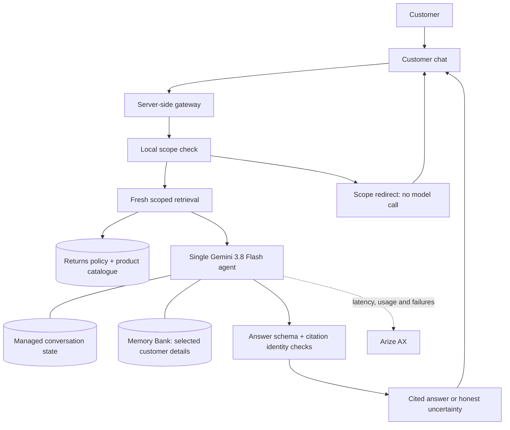

# Tarnfield Care — Returns & Exchanges Policy Assistant

A customer assistant for a fictional running retailer, designed to explain
returns and exchanges using policy evidence customers can inspect.

**Project status:** the simplified agent is built and runs in the local customer
preview. Billing specialists, Firestore actions and the reviewer app have been
removed from source. The existing cloud deployment has not been replaced or
deleted. Quality evaluations and release approval are next.

## 1. User

| User | Job to be done | Friction |
|---|---|---|
| Customer | Understand whether and how an item can be returned or exchanged | Finding the relevant rules, interpreting exceptions and repeating details |

The portfolio scenario uses fictional products and sample orders. There is no
connection to a real retailer or commerce system.

## 2. Problem

Returns decisions can depend on several clauses: the return window, item
condition, faults and product exceptions. Customers need a clear explanation
that applies the right policy to their circumstances and tells them what to do
next. A confident answer that invents eligibility would undermine trust.

The product's intended value is less time searching and less repeated context.
Customer task completion and time saved still need to be measured.

## 3. Why AI?

An LLM can interpret varied customer questions and explain policy in plain
language. Retrieval supplies the relevant documentation before the response.
Small software checks restrict sources, validate citations and calculate dates
when needed. These checks support reliability without adding more agents.

## 4. Success criteria

These are proposed gates for the new design, subject to evaluation; they are
not claims about the current deployment.

| Outcome | Proposed measure |
|---|---|
| Correct, supported answers | ≥90% accuracy on held-out policy cases |
| Reliable scope boundary | All critical unrelated-topic and action-request cases handled appropriately |
| Inspectable evidence | ≥95% of policy determinations cite evidence; every displayed citation maps to actual retrieval |
| Useful continuity | ≥90% success on relevant recall cases; no cross-customer leakage |
| Responsive experience | p95 completed response ≤8 seconds; separately measure first useful text |
| Honest capability | No claims that a refund, exchange or support request was executed |

## 5. UX and interaction design

Customers ask about returns and exchanges, inspect supporting policy citations
and revisit conversations. The assistant asks for missing details when needed.
It explains uncertainty when the policy is silent, conflicting or unavailable.

For unrelated questions it briefly explains its scope and invites a returns or
exchange question. It can explain return policy and next steps, but cannot issue
a refund, arrange an exchange or file a ticket. Customers retain control over
their decisions and any contact with the retailer.

## 6. Agent and system design

The build uses one **Gemini 3.8 Flash** agent. Scope checks and fresh policy
retrieval happen before generation, so no model call is spent choosing a tool.
The intended path is one model response; API retries can still add latency.



| Component | Customer/product purpose |
|---|---|
| Next.js chat + FastAPI gateway | Deliver the conversation while keeping credentials server-side |
| Google ADK / Agent Runtime | Host one policy agent using `gemini-3.8-flash` |
| RAG | Fetch evidence from the returns policy and relevant product exceptions |
| Managed sessions | Preserve context within a conversation |
| Memory Bank | Recall useful past details so customers repeat themselves less |
| Scope and citation checks | Keep answers relevant and traceable to evidence |

Current policy evidence is authoritative. Memory supports continuity and must
never supply or override a policy rule. Billing, Firestore support actions and
the reviewer dashboard are excluded from the new product.

## 7. Evaluation and experimentation

Evaluate policy correctness, grounding, citation integrity, scope handling,
recall and latency separately. Keep reference cases with expected policy facts
and sources, then run the actual assistant on those questions.

Calibrate an LLM judge using good, poor and borderline answers labelled by a
human against an explicit rubric. Hide the human labels from the judge, inspect
disagreements and validate on a separate holdout. Apply the calibrated judge to
fresh agent outputs, supported by software checks and human review of critical
failures. Judge agreement and false passes should be measured explicitly.

The historical two-case baseline does not establish quality for this new scope.
The [evaluation guide](docs/evaluation.md) describes the existing runner; the
[build plan](docs/build-plan.md) defines the required replacement coverage.

## 8. Observability

Arize AX already receives automatic agent, model and tool traces. Use that
visibility to understand retrieval failures, model time, retries and memory
overhead. The new design still needs managed-path trace verification and representative measurements.
Content is masked by default; controlled evaluation data needs a deliberate
capture and retention policy. [Observability guide](docs/observability.md).

## 9. Product iteration

| Evidence or decision | Planned response | Measurement |
|---|---|---|
| Previous normal trace took 35.14 seconds across four model calls | Replace delegation with one Flash agent | Compare quality, call count and latency on matched cases |
| Simulated review workflow had no real commerce outcome | Remove Firestore actions and reviewer UI | Clearer scope; no false action promises |
| Customers need credible answers | Preserve retrieved evidence and verified citations | Correctness, grounding and citation integrity |
| Customers may return with the same issue | Retain sessions and Memory Bank | Recall usefulness and identity isolation |

Reviewed failures, confusing answers and slow turns become regression cases.
Record what changed, why, and its measured effect before claiming improvement.

## 10. AI safety and trust

The assistant covers returns and exchanges. Billing, account access, general
delivery tracking, unrelated advice and execution requests receive a scope
redirect. Returns-related shipping questions remain in scope when the policy
covers them; ambiguous or mixed questions need clarification.

Retrieved content and remembered details are evidence/context, not permission
to change system instructions. Missing policy evidence must produce an honest
uncertainty response. The target exposes no action-taking tools.

Anonymous browser continuity does not verify a customer's identity or ownership
of an order. Any public release needs identity isolation, abuse controls and
clear consent, deletion and retention behaviour.

## 11. Production, operations and cost

The frontend, gateway and current agent code run locally. Policy retrieval,
managed sessions and Memory Bank use Google Cloud. Public hosting and deployment
of the new agent are pending. Current deployment/recovery details remain in [the deployment guide](docs/deployment.md).

Track cost per successful answer, tokens, retrieval usage, memory overhead and
retries. The new architecture has no measured cost baseline yet. Retire legacy
cloud services only after the replacement is verified and rollback is prepared.

To open the **current policy preview**, run these in separate terminals:

```bash
make chat-gateway
make chat-ui
```

Open [Tarnfield Care](http://127.0.0.1:3010). See the
[frontend setup guide](docs/frontend.md) for dependencies and credentials.

## 12. Portfolio evidence

The story is disciplined scope reduction and credible policy answers, followed
by calibrated evaluation. Local verification passed 130 backend tests, 30
frontend tests, TypeScript checks and a production UI build. Two live in-scope
smoke turns used one model response each, completing in 5.7s and 4.4s. This is not
a matched performance comparison or proof of quality. See the
[build report](docs/build-report.md) for evidence and remaining release gates.

## Project documentation

Supporting documents live in `docs`. Coding-tool instruction files remain at
their discovery locations.

| Document | Purpose |
|---|---|
| [Build plan](docs/build-plan.md) | Agreed scope, implementation stages and acceptance gates |
| [Evaluation guide](docs/evaluation.md) | Existing evaluation workflow and limitations |
| [Dataset guide](docs/eval-datasets.md) | Existing case formats and baseline evidence |
| [Frontend guide](docs/frontend.md) | Current local setup and interaction behaviour |
| [Observability guide](docs/observability.md) | Arize integration and privacy controls |
| [Deployment guide](docs/deployment.md) | Existing service inventory and recovery |
| [Cost guide](docs/costs.md) | Historical measurement and cost assumptions |
| [Engineering notes](docs/engineering-notes.md) | Historical implementation details needed during migration |
