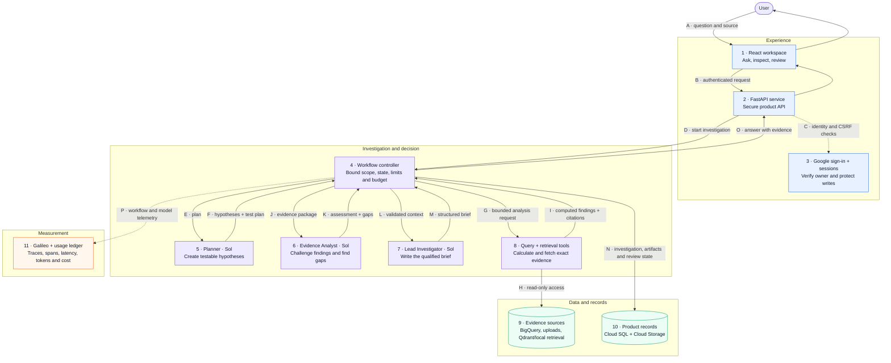

# SourceLens

**An AI investigation workspace that turns business questions into evidence-backed decisions.**

[Try the live product](https://sourcelens-tdghggm6ma-uc.a.run.app) · [Product brief](PRODUCT.md) · [Build and cost plan](BUILD.md) · [Codebase review](CODEBASE_REVIEW.md)

SourceLens uses LLMs for open-ended investigative judgment and deterministic controls for exactness, safety, and provenance. Users can verify the evidence behind an answer, while the system measures quality, latency, and cost in production.

## 1. User

The first user is a **product manager investigating a change in customer experience or business performance**. They can frame the decision they need to make, but the relevant evidence may be scattered across sales, inventory, returns, ratings, and customer comments.

SourceLens currently runs as a **one-user application** for its owner. The data model is owner-scoped so that multi-user access can be added later without redesigning data isolation.

## 2. Problem

Answering a question such as *“Why did revenue and customer sentiment fall for Nova X300?”* usually requires a PM to:

1. find and join the right data;
2. decide which explanations are worth testing;
3. run several quantitative and qualitative checks;
4. separate evidence from plausible speculation; and
5. turn the work into a decision-ready narrative.

General chat tools can produce a fluent answer, but they do not reliably prove which source, query, or customer excerpt supports each claim. Traditional dashboards provide trusted metrics, but the user must already know which cuts of the data to inspect.

**Job to be done:** Help me understand what changed, investigate credible explanations, and reach a conclusion I can verify without manually directing every analytical step.

## 3. Why AI?

This problem benefits from AI because the investigation is not a fixed sequence. The system must interpret an open-ended question, propose useful hypotheses, challenge competing explanations, and communicate a qualified conclusion.

AI does not control the parts that require exactness. Deterministic software resolves sources, validates read-only SQL, executes calculations, enforces limits, stores evidence, and records provenance.

| AI is used for | Deterministic software is used for |
| --- | --- |
| Interpreting the user's intent | Authentication and authorization |
| Planning testable hypotheses | Source and entity resolution |
| Challenging evidence and identifying gaps | SQL validation and execution |
| Synthesizing a clear, qualified brief | Calculations, limits, storage, and provenance |

This split lets the model exercise judgment without allowing it to invent source access, calculations, citations, or write operations.

## 4. Product experience

The core loop is:

> **Ask → investigate → inspect evidence → review → retain the decision**

1. **Connect evidence.** Upload CSV, XLSX, PDF, DOCX, or DOC files, or connect a BigQuery dataset through a guided read-only setup.
2. **Ask a business question.** Select the relevant source and describe the decision or change to investigate.
3. **Watch the investigation.** SourceLens plans hypotheses, runs controlled analysis, checks counterevidence, and produces a structured brief.
4. **Inspect the proof.** Quantitative claims link to stored query artifacts; qualitative claims link to exact source excerpts.
5. **Apply human judgment.** Accept, edit and accept, or reject the brief. Each review creates an immutable notebook version and captures user ratings.

The reference journey investigates a Q4 2025 revenue and sentiment decline for Nova X300. SourceLens decomposes revenue into units and realised price, compares returns and availability, retrieves customer comments, and distinguishes supported association from causal proof.

## 5. Success criteria

SourceLens is designed to measure product value and operational quality together.

| Outcome | Measure | Current state |
| --- | --- | --- |
| Faster investigation | Time from question to reviewable brief | Latency captured per run; benchmark target is the next product milestone |
| Verifiable conclusions | Material claims linked to inspectable evidence | Implemented for query artifacts and source excerpts |
| Useful output | User accepts or edits and accepts the brief | Review state and ratings are persisted |
| Predictable quality | Pass rate on a representative eval set | Historical bounded eval: 5/5; needs rerun after the persistence migration |
| Controlled economics | Tokens and model cost per completed investigation | Persisted for every successful model call |
| Reliable operation | Completion, failure, and recovery rates | Events and traces exist; a product dashboard and alerts remain on the roadmap |

The primary product metric should become **accepted investigations with verified evidence**. Latency and cost are guardrail metrics because a high-quality answer that is too slow or expensive will not become a repeated workflow.

## 6. Architecture and data flow

The diagram follows one user question from the interface to a reviewed answer. Numbered blocks correspond to the table below it.



**Legend:** blue = user experience and access · purple = investigation logic and AI · green = evidence and persistent records · orange = observability · solid arrows = product data flow · dashed arrows = control or telemetry.

| Block | Explanation |
| --- | --- |
| **1 · React workspace** | The user connects a source, asks a question, follows progress, inspects evidence, and reviews the result. |
| **2 · FastAPI service** | Provides the product API, validates requests, serves the frontend, and returns investigation state and artifacts. |
| **3 · Google sign-in + sessions** | Verifies the approved Google account, issues an opaque HttpOnly session, and protects state-changing requests with CSRF checks. |
| **4 · Workflow controller** | Owns investigation state and coordinates each bounded step, including scope, limits, model budget, and persistence. |
| **5 · Research Planner** | Converts the question and available source catalog into testable hypotheses and a limited investigation plan. |
| **6 · Evidence Analyst** | Challenges computed findings, looks for counterevidence, states limitations, and recommends the next useful check. |
| **7 · Lead Investigator** | Combines the plan, calculations, evidence, and caveats into a decision-ready brief with typed output. |
| **8 · Query + retrieval tools** | Run validated read-only queries and retrieve exact qualitative excerpts. They return evidence references alongside results. |
| **9 · Evidence sources** | Hold the connected business data: BigQuery tables, uploaded documents and tabular files, plus vector or lexical retrieval indexes. |
| **10 · Product records** | Cloud SQL stores users, sessions, investigations, reviews, events, and usage. Cloud Storage retains versioned source files and manifests. |
| **11 · Galileo + usage ledger** | Groups the full multi-agent workflow into one observable session and records spans, latency, tokens, and estimated model cost. |

### Agent responsibilities

All model-backed roles currently use `gpt-5.6-sol`.

| Role | Product responsibility | Boundary |
| --- | --- | --- |
| Research Planner | Decide what should be tested | Cannot execute arbitrary SQL or claim a finding |
| Evidence Analyst | Assess support, counterevidence, and gaps | Receives computed evidence rather than unrestricted source access |
| Lead Investigator | Produce the final decision brief | Must preserve qualifications and evidence references |

Python owns workflow state and passes typed outputs between roles. The system does not rely on an unbounded agent transcript as memory.

## 7. Trust, safety, and failure handling

- **Evidence before confidence:** findings remain linked to a stored query result or source excerpt; unsupported certainty is treated as a quality failure.
- **Human review:** the user decides whether a brief is accepted, edited, or rejected. The AI does not make the business decision.
- **Read-only analysis:** BigQuery access is validated, table-allowlisted, dry-run first, and capped at 10 GiB billed per query.
- **Prompt injection boundary:** retrieved content is evidence, not an instruction channel. Tools and workflow permissions remain defined in code.
- **Owner-scoped data:** sources, investigations, notebook entries, usage records, and uploaded objects are isolated by owner.
- **Graceful degradation:** local lexical retrieval is available when Qdrant is absent, and the product continues if Galileo is unavailable.
- **Cost protection:** each run has a model budget, live-run ceiling, rate limit, bounded result set, and persisted token and cost records.

The main unresolved reliability risk is that investigations run inside the Cloud Run web process. A container restart can interrupt an active run. Durable task execution and stale-run recovery are the highest-priority production hardening items.

## 8. Evaluation and observability

One investigation maps to one Galileo session. Each initial run or refinement becomes a workflow trace containing Planner, Evidence Analyst, Lead Investigator, model generations, and nested spans.

Cloud SQL also records every successful model call with its role, model, input and output tokens, elapsed time, estimated cost, investigation, and owner. This independent ledger keeps core product metrics available if the tracing vendor is unavailable.

Latest validation on **26 September 2026**:

- backend integration suite: **40 passed**, with the paid live-model test intentionally skipped;
- frontend: **7 tests passed**;
- Python lint, TypeScript, and the Vite production build passed;
- historical bounded eval: baseline **4/5**, calibrated rerun **5/5**.

The historical eval predates the owner-aware persistence migration. The eval runner needs repair and a broader dataset before the project can claim current end-to-end quality. The [latest saved artifact](artifacts/evals/bounded-eval.json) remains available for inspection.

## 9. Product decisions and tradeoffs

| Decision | Why | Tradeoff |
| --- | --- | --- |
| One approved user first | Keeps the initial release focused while exercising production authentication | Does not yet prove onboarding or collaboration |
| Three bounded agent roles | Makes planning, challenge, and synthesis observable and independently evaluable | Adds latency and model cost compared with one call |
| Sol for every model-backed role | Keeps behavior consistent while quality is being established | Smaller task-specific models could lower cost later |
| Deterministic analysis tools | Improves reproducibility, provenance, and safety | Arbitrary datasets require more onboarding work |
| Application-level auth on public Cloud Run | Supports a normal browser sign-in flow | The API must maintain strong session and CSRF controls |
| Optional Qdrant and Galileo | Core investigations can still complete during dependency outages | Fallback retrieval and local telemetry offer fewer capabilities |

## 10. What comes next

The next product milestones are ordered by user value and learning:

1. **Prove reliability:** move work to durable execution, recover interrupted runs, and show clear retry states.
2. **Measure the experience:** add an authenticated dashboard for completion rate, total latency, per-agent latency, tokens, cost, and review outcomes.
3. **Strengthen quality evidence:** repair the eval runner, expand representative cases, and compare workflow or model changes before release.
4. **Make source onboarding useful:** infer schemas and measures for a newly connected BigQuery dataset, then let the user confirm the mapping.
5. **Close the feedback loop:** use rejection reasons, ratings, refinements, and abandoned runs to prioritize prompt and product changes.
6. **Prepare for more users only when needed:** add onboarding, user-level quotas, administration, and privacy controls after the single-user workflow proves repeat value.

## 11. Run and validate locally

<details>
<summary><strong>Local setup</strong></summary>

Prerequisites: Python 3.11+, `uv`, Node 22+, and `gcloud` authenticated as the project owner. Cloud SQL must be running.

```bash
cp .env.example .env
cp frontend/.env.example frontend/.env
make install
make db-start
make db-migrate
npm --prefix frontend run build
make dev
```

Run the Vite development server in another terminal:

```bash
make frontend
```

Open `http://localhost:5173`. Never commit `.env`.

Key configuration:

```dotenv
SOURCELENS_COMPLEX_MODEL=gpt-5.6-sol
SOURCELENS_SIMPLE_MODEL=gpt-5.6-sol
SOURCELENS_LIVE_AGENT=1
SOURCELENS_WAREHOUSE=bigquery
GOOGLE_OAUTH_CLIENT_ID=...
OPENAI_API_KEY=...
GALILEO_API_KEY=...
GALILEO_PROJECT=sourcelens
GALILEO_LOG_STREAM=log-stream-sourcelens
```

</details>

<details>
<summary><strong>Validation commands</strong></summary>

```bash
uv run ruff check src tests evals scripts migrations
make test
npm --prefix frontend test -- --run
npm --prefix frontend run build
```

`make test` uses Cloud SQL, BigQuery, and Cloud Storage. The paid live-model test is excluded unless explicitly requested:

```bash
make test-live
```

</details>

<details>
<summary><strong>Cloud Run deployment</strong></summary>

```bash
make deploy
```

The deployment script checks the active Google account, applies database migrations, grants the runtime service account its required roles, attaches Secret Manager values, builds the container, and deploys the application with live Sol calls, BigQuery, Cloud Storage, and Galileo configured.

</details>

## Current product boundaries

- Integrated commerce analysis currently compares Q3 and Q4 2025; general date parsing is not implemented.
- A new BigQuery dataset is verified and sampled, but it does not yet receive unrestricted generated SQL.
- Uploaded-source investigations profile at most 500 records and retain bounded excerpts.
- Usage and review metrics are persisted but do not yet have a product dashboard.
- Run and spend ceilings are global safeguards rather than multi-user billing controls.
- Legacy Firebase naming and a compatibility bearer-token path remain from the previous authentication implementation and should be removed after release verification.

Detailed engineering findings and the update sequence are maintained in [CODEBASE_REVIEW.md](CODEBASE_REVIEW.md).
